# Python: Basics to Advanced

> A practical study guide with theory, coding examples, Mermaid diagrams, interview revision, exercises, and a complete database project.
>
> **Compatibility:** Main examples target Python 3.11+. Newer syntax is labeled Python 3.12+ or 3.14+. Third-party examples state their dependencies. Run separate examples in separate files unless filenames explicitly connect them.
>
> **How to study:** Read the explanation, predict the output, run the code, change the inputs, and solve the exercises. This guide covers the core language and professional development practices; specialist frameworks and libraries have their own larger references.
>
> **Diagrams:** Open this file in GitHub or a Mermaid-enabled Markdown preview. Some VS Code previews need a Mermaid extension to render fenced diagrams.

## Contents

1. [Python and program execution](#1-python-and-program-execution)
2. [Installation, terminal, and virtual environments](#2-installation-terminal-and-virtual-environments)
3. [Syntax, comments, and coding style](#3-syntax-comments-and-coding-style)
4. [Variables, objects, and data types](#4-variables-objects-and-data-types)
5. [Input, output, and conversions](#5-input-output-and-conversions)
6. [Operators and truth values](#6-operators-and-truth-values)
7. [Conditions and pattern matching](#7-conditions-and-pattern-matching)
8. [Loops and iteration patterns](#8-loops-and-iteration-patterns)
9. [Strings and Unicode](#9-strings-and-unicode)
10. [Lists and tuples](#10-lists-and-tuples)
11. [Sets and dictionaries](#11-sets-and-dictionaries)
12. [Comprehensions and unpacking](#12-comprehensions-and-unpacking)
13. [Functions and parameters](#13-functions-and-parameters)
14. [Scope, closures, and functional tools](#14-scope-closures-and-functional-tools)
15. [Recursion and algorithm analysis](#15-recursion-and-algorithm-analysis)
16. [Modules, packages, and imports](#16-modules-packages-and-imports)
17. [Exceptions and error design](#17-exceptions-and-error-design)
18. [Files, paths, and serialization](#18-files-paths-and-serialization)
19. [Useful standard-library modules](#19-useful-standard-library-modules)
20. [Regular expressions](#20-regular-expressions)
21. [Object-oriented programming](#21-object-oriented-programming)
22. [Inheritance, composition, and abstraction](#22-inheritance-composition-and-abstraction)
23. [Special methods and the data model](#23-special-methods-and-the-data-model)
24. [Dataclasses and enums](#24-dataclasses-and-enums)
25. [Iterators and generators](#25-iterators-and-generators)
26. [Decorators](#26-decorators)
27. [Context managers](#27-context-managers)
28. [Type hints and protocols](#28-type-hints-and-protocols)
29. [Descriptors and attribute access](#29-descriptors-and-attribute-access)
30. [Metaclasses and introspection](#30-metaclasses-and-introspection)
31. [Memory, copying, and garbage collection](#31-memory-copying-and-garbage-collection)
32. [Concurrency, parallelism, and the GIL](#32-concurrency-parallelism-and-the-gil)
33. [Threads and synchronization](#33-threads-and-synchronization)
34. [Processes and executors](#34-processes-and-executors)
35. [Asyncio and structured concurrency](#35-asyncio-and-structured-concurrency)
36. [Testing and debugging](#36-testing-and-debugging)
37. [Logging and configuration](#37-logging-and-configuration)
38. [Databases and transactions](#38-databases-and-transactions)
39. [HTTP, APIs, and backend architecture](#39-http-apis-and-backend-architecture)
40. [Command-line tools and subprocesses](#40-command-line-tools-and-subprocesses)
41. [Packaging and project structure](#41-packaging-and-project-structure)
42. [Performance and profiling](#42-performance-and-profiling)
43. [Security and reliability](#43-security-and-reliability)
44. [Advanced architecture and language techniques](#44-advanced-architecture-and-language-techniques)
45. [Modern Python version notes](#45-modern-python-version-notes)
46. [Data science and specialist directions](#46-data-science-and-specialist-directions)
47. [Complete project: SQLite task manager](#47-complete-project-sqlite-task-manager)
48. [Solved coding problems](#48-solved-coding-problems)
49. [Practice roadmap and project assignments](#49-practice-roadmap-and-project-assignments)
50. [Interview questions and answers](#50-interview-questions-and-answers)
51. [Cheat sheets and common mistakes](#51-cheat-sheets-and-common-mistakes)
52. [Official references](#52-official-references)

---

## 1. Python and program execution

Python is a high-level, general-purpose programming language used for automation, backend services, testing, data processing, scientific computing, and machine learning. It supports procedural, object-oriented, and functional programming styles.

**High-level** means ordinary programs use objects and collections instead of managing raw memory. **Dynamically typed** means names can refer to objects of different types during execution. **Strongly typed** means incompatible types generally are not silently combined: `"5" + 2` raises `TypeError`.

Python is a language; CPython is its most widely used implementation. In normal CPython execution, source is parsed and compiled into bytecode, then executed by the interpreter. Imported modules may have bytecode cached under `__pycache__`. Bytecode is different from native machine code, and these implementation details are not universal promises of the language.

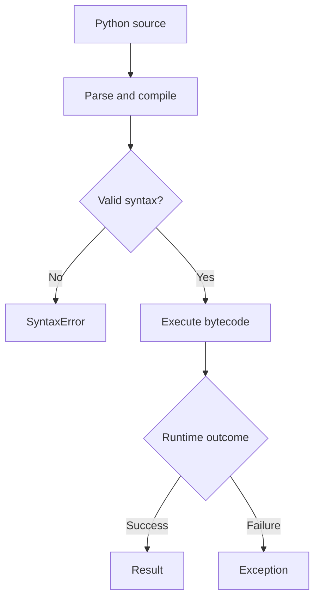

```python
print("Hello, Python!")  # Hello, Python!
```

Python emphasizes readability and development speed. CPU-intensive pure-Python loops can be slower than compiled native code; many numerical libraries address this by executing optimized native operations.

## 2. Installation, terminal, and virtual environments

Install a supported Python release through an official installer or your OS package manager. The interpreter command is commonly `python3` on Linux/macOS and `py` on Windows before environment activation.

```bash
# Linux/macOS; bash and zsh
python3 --version
python3 -m venv .venv
source .venv/bin/activate
python --version
python -m pip --version
```

```powershell
# Windows PowerShell
py --version
py -m venv .venv
.venv\Scripts\Activate.ps1
python --version
```

If activation is unavailable, run `.venv/bin/python` on Linux/macOS or `.venv\Scripts\python.exe` on Windows directly. Some Linux distributions require installation of the matching venv package first.

A virtual environment isolates project packages; it is not a security sandbox and does not automatically download a different interpreter version. Keep `.venv/` out of Git. For an “externally managed environment” error, use a virtual environment rather than forcing installation into system Python.

```bash
python -m pip install requests
python -m pip show requests
python -m pip list
python -m pip freeze > requirements.txt
python -m pip install -r requirements.txt
deactivate
```

`pip freeze` records installed versions but is not a complete cross-platform lockfile strategy. Using `python -m pip` helps ensure pip belongs to the selected interpreter.

| Method | Example | Purpose |
|---|---|---|
| REPL | `python` | Interactive experiments |
| Script | `python hello.py` | Run a file |
| Module | `python -m unittest` | Run a module as an application |
| Short command | `python -c "print(2 + 3)"` | Quick checks |
| Notebook | Jupyter notebook | Exploration; execution order affects state |

## 3. Syntax, comments, and coding style

Indentation defines blocks. Use four spaces, avoid mixing tabs and spaces, and put a colon after statements that introduce suites.

```python
age = 20
if age >= 18:
    print("Adult")
else:
    print("Minor")
```

Names are case-sensitive. Use `snake_case` for functions and variables, `PascalCase` for classes, and `UPPER_CASE` for constants by convention. Avoid shadowing built-ins such as `list`, `str`, and `sum`.

`#` starts a comment. Triple-quoted text is a string, not a special multiline comment. A docstring is a string at the beginning of a function, class, or module that documents that object. `pass` is a no-operation statement used when a body is required.

```python
def rectangle_area(width, height):
    """Return a rectangle's area."""
    return width * height

amount = (
    100
    + 25
    - 10
)
print(rectangle_area(4, 3))  # 12
```

Prefer parentheses to backslash continuation. Comments should explain reasons or non-obvious constraints; clear code usually does not need a comment repeating each statement.

## 4. Variables, objects, and data types

A variable is a name bound to an object. Assignment neither gives the name a permanent type nor automatically copies the object.

```python
value = 10
print(type(value))  # <class 'int'>
value = "ten"
print(type(value))  # <class 'str'>

left = [1, 2]
right = left
right.append(3)
print(left)          # [1, 2, 3]
print(left is right) # True
```

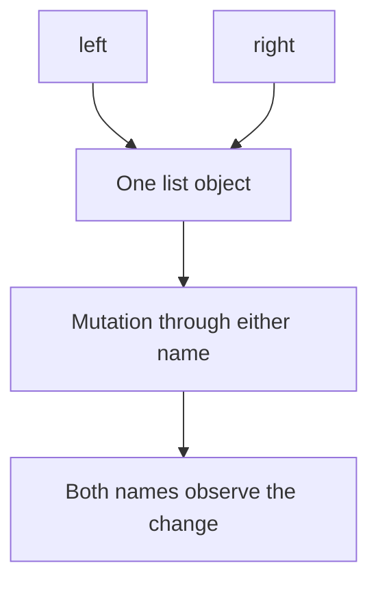

| Type | Example | Mutable? | Meaning |
|---|---|---|---|
| `int` | `42` | No | Arbitrary-precision integer within memory limits |
| `float` | `3.5` | No | Binary floating-point number |
| `complex` | `2 + 3j` | No | Real and imaginary components |
| `bool` | `True` | No | Boolean; subclass of int |
| `str` | `"Python"` | No | Unicode text |
| `list` | `[1, 2]` | Yes | Ordered sequence |
| `tuple` | `(1, 2)` | No | Fixed sequence of references |
| `set` | `{1, 2}` | Yes | Unique hashable members |
| `frozenset` | `frozenset({1})` | No | Immutable set |
| `dict` | `{"name": "Ajay"}` | Yes | Insertion-ordered mapping |
| `bytes` | `b"abc"` | No | Binary data |
| `bytearray` | `bytearray(b"abc")` | Yes | Mutable binary data |
| `NoneType` | `None` | No | Absence of a value |

Mutability means object state can change. Hashability means an object has a stable hash compatible with equality. Set members and dictionary keys must be hashable. A tuple containing a list is not hashable even though the tuple cannot replace its stored references.

```python
point = (10, 20)
locations = {point: "classroom"}
print(locations[(10, 20)])  # classroom
```

## 5. Input, output, and conversions

`input()` returns a string. Convert it and validate its range before use.

```python
raw = input("Enter age: ")
try:
    age = int(raw)
    if age < 0:
        raise ValueError("Negative age")
    print(f"Next year: {age + 1}")
except ValueError:
    print("Enter a non-negative whole number.")
```

```python
print(int("42"))      # 42
print(float("3.25"))  # 3.25
print(str(42))        # Text representation
print(list("cat"))    # ['c', 'a', 't']
print(int(3.9))       # 3: truncates toward zero
print(bool("False")) # True: nonempty string
print("A", "B", sep=" | ", end="!\n")

score = 88.756
print(f"Score: {score:.2f}")  # Score: 88.76
print(f"{1000000:,}")        # 1,000,000
print(f"{0.875:.1%}")        # 87.5%
```

`int("3.5")` raises `ValueError`. Formatting controls presentation, not the stored numeric precision. Never use `eval(input())` as an input parser.

## 6. Operators and truth values

| Category | Operators | Notes |
|---|---|---|
| Arithmetic | `+ - * / // % **` | Division, floor division, remainder, exponentiation |
| Comparison | `== != < <= > >=` | Comparisons can chain |
| Boolean | `and or not` | Short-circuit evaluation |
| Membership | `in not in` | Container membership |
| Identity | `is is not` | Same object, not equal contents |
| Bitwise | `& \| ^ ~ << >>` | Integer bit operations |
| Assignment | `= += -= *= ...` | Bind or update |
| Assignment expression | `:=` | Bind within an expression |

```python
print(7 / 2)     # 3.5
print(-7 // 2)   # -4: floor toward negative infinity
print(-7 % 2)    # 1
print(2 ** 3)    # 8
print(5 & 3)     # 1
print(1 << 3)    # 8
```

Falsy values include `None`, `False`, numeric zero, and empty collections/strings. Objects can customize truth testing through `__bool__` or `__len__`. `and` and `or` return operands, not necessarily Boolean objects.

```python
print("" or "default")   # default
print("hello" and 42)    # 42
print([1] == [1])        # True
print([1] is [1])        # False
print(None is None)      # True
```

Use `==` for values and `is None` for the `None` singleton. Do not rely on integer/string interning. Parentheses clarify precedence: `-2 ** 2` is `-4`, whereas `(-2) ** 2` is `4`.

## 7. Conditions and pattern matching

```python
marks = 76
if marks >= 90:
    grade = "A"
elif marks >= 75:
    grade = "B"
elif marks >= 60:
    grade = "C"
else:
    grade = "Needs improvement"
print(grade)  # B
status = "pass" if marks >= 40 else "fail"
```

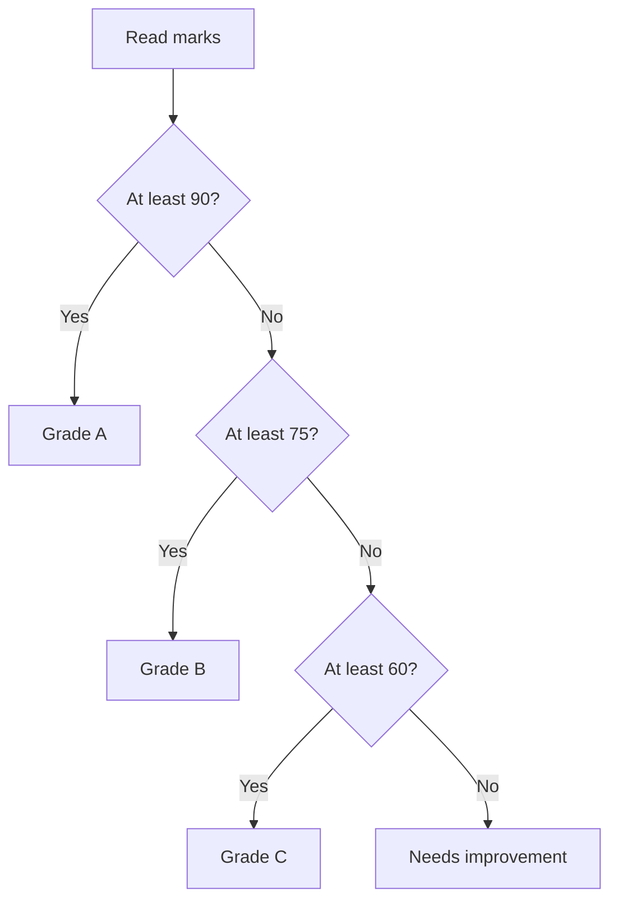

Structural pattern matching, available since Python 3.10, recognizes shapes such as mappings and sequences. It is more than a switch statement. A bare name usually captures a value instead of comparing against an existing variable.

```python
def describe_event(event):
    match event:
        case {"type": "login", "user": str(name)}:
            return f"Login by {name}"
        case [x, y]:
            return f"Coordinate: {x}, {y}"
        case _:
            return "Unknown event"

print(describe_event({"type": "login", "user": "Ajay"}))
```

Mapping patterns permit additional keys. `_` is a wildcard. A guard such as `case pattern if condition:` adds a condition after matching. Cases do not fall through.

## 8. Loops and iteration patterns

A `for` loop consumes an iterable. A `while` loop repeats while its condition is true.

```python
for number in range(1, 4):
    print(number)  # 1, 2, 3 on separate lines

remaining = 3
while remaining > 0:
    remaining -= 1
print(remaining)  # 0

print(list(range(5, 0, -2)))  # [5, 3, 1]
for index, name in enumerate(["Ajay", "Akash"], start=1):
    print(index, name)
for name, score in zip(["A", "B"], [80, 90], strict=True):
    print(name, score)
```

`range` excludes its stop value. `zip` normally stops at the shortest input; `strict=True` raises an error for unequal lengths. `enumerate` pairs indices with values.

`break` exits the nearest loop, `continue` starts its next iteration, and loop `else` runs if the loop finishes without `break`, including zero iterations.

```python
for number in [2, 4, 7, 8]:
    if number % 2:
        print("First odd:", number)
        break
else:
    print("No odd number")
```

Do not change a list's structure while iterating over it without a carefully defined strategy. Filter into a new list instead. Nested full scans of n values often result in O(n²) work.

## 9. Strings and Unicode

A string is an immutable sequence of Unicode code points. One visible character may contain multiple code points, so `len` does not always count human-visible characters.

```python
text = "Python"
print(text[0], text[-1])  # P n
print(text[1:4])         # yth
print(text[:3])          # Pyt
print(text[::-1])        # nohtyP
```

Slicing uses `[start:stop:step]`, excluding stop. Out-of-range slices are tolerated, but indexing beyond bounds raises `IndexError`.

```python
print("  Learn Python  ".strip().lower())
print("a,b,c".split(","))
print("-".join(["2026", "09", "12"]))
print("banana".replace("a", "o"))  # bonono
print("notes.py".endswith(".py"))  # True
print("Straße".casefold() == "STRASSE".casefold())  # True
```

`strip("ab")` removes any leading/trailing characters from that character set, not an exact substring. Use `removeprefix`/`removesuffix` for exact affixes. Use `join` when combining many strings.

```python
text = "नमस्कार"
encoded = text.encode("utf-8")
restored = encoded.decode("utf-8")
assert restored == text
```

Encode text into bytes and decode bytes into text. Always know the encoding at a file/network boundary. Reversing code points is not a complete Unicode grapheme-reversal algorithm.

## 10. Lists and tuples

Lists are mutable sequences; tuples are fixed sequences of references. Use lists for changing collections and tuples for simple fixed records or returning multiple values.

```python
items = [30, 10, 20]
items.append(40)
items.extend([50, 60])
items.insert(0, 5)
removed = items.pop()
items.remove(10)
print(items)  # [5, 30, 20, 40, 50]
print(removed)  # 60
ordered = sorted(items)
items.sort(reverse=True)
print(ordered)  # [5, 20, 30, 40, 50]
```

`sort` mutates and returns `None`; `sorted` creates a new list. Sorting is stable: equal-key items retain their relative order.

| List operation | Typical complexity |
|---|---|
| Index access | O(1) |
| Append | Amortized O(1) |
| Pop from end | O(1) |
| Insert/delete near front | O(n) |
| Membership | O(n) |
| Sort | O(n log n) worst case |
| Slice of k elements | O(k) time and space |

```python
student = (256307, "Ajay", 88)
roll, name, marks = student
single = (42,)  # The comma matters
print(name, single)

record = ([1, 2], "group")
record[0].append(3)
print(record)  # ([1, 2, 3], 'group')
```

Tuple immutability does not freeze nested mutable objects. Repeating mutable rows can create aliasing:

```python
bad = [[0] * 3] * 2
bad[0][0] = 9
print(bad)  # [[9, 0, 0], [9, 0, 0]]
good = [[0] * 3 for _ in range(2)]
good[0][0] = 9
print(good) # [[9, 0, 0], [0, 0, 0]]
```

## 11. Sets and dictionaries

Sets store unique hashable values without positional indexing or a guaranteed iteration order. `{}` is an empty dictionary; `set()` is an empty set.

```python
a, b = {1, 2, 3}, {3, 4}
print(sorted(a | b))  # [1, 2, 3, 4]: union
print(sorted(a & b))  # [3]: intersection
print(sorted(a - b))  # [1, 2]: difference
print(sorted(a ^ b))  # [1, 2, 4]: symmetric difference
print({1, 2} <= a)    # True: subset
a.add(5)
a.discard(99)        # Missing value is okay
```

`remove` raises `KeyError` if missing; `discard` does not.

Dictionaries map hashable keys to values and preserve insertion order, not sorted order.

```python
student = {"name": "Ajay", "marks": 88}
student["course"] = "MSc CA"
print(student.get("city", "Unknown"))
for key, value in student.items():
    print(key, value)
updated = student | {"marks": 95}
print(updated["marks"])  # Right mapping wins

frequencies = {}
for letter in "banana":
    frequencies[letter] = frequencies.get(letter, 0) + 1
print(frequencies)  # {'b': 1, 'a': 3, 'n': 2}
```

`d[key]` raises `KeyError` if absent. `d.get(key)` defaults to `None`. `key in d` checks keys. Views such as `d.keys()` reflect later changes. Average dict/set lookup is O(1), with possible O(n) worst cases. Equal keys such as `1` and `True` address the same dictionary entry.

## 12. Comprehensions and unpacking

Comprehensions build collections from iteration and optional filtering.

```python
squares = [n * n for n in range(6)]
even_squares = [n * n for n in range(6) if n % 2 == 0]
lengths = {word: len(word) for word in ["python", "api"]}
unique_lengths = {len(word) for word in ["cat", "dog", "python"]}
print(squares)       # [0, 1, 4, 9, 16, 25]
print(even_squares)  # [0, 4, 16]
print(lengths)       # {'python': 6, 'api': 3}
```

A generator expression is lazy; it does not allocate all results immediately.

```python
squares = (n * n for n in range(1_000_000))
print(next(squares))  # 0
first, *middle, last = [10, 20, 30, 40]
print(first, middle, last)  # 10 [20, 30] 40
combined = [*[1, 2], *[3, 4]]
settings = {**{"theme": "light"}, **{"theme": "dark"}}
print(combined, settings)
```

Do not use comprehensions solely for side effects. `*` expands positional values and `**` expands mappings. Duplicate keyword arguments at a function call raise an error, unlike duplicate keys in a dictionary display where later values win.

## 13. Functions and parameters

Functions name reusable operations. Favor explicit inputs, focused responsibilities, and documented return values.

```python
def calculate_total(price, quantity=1):
    """Return the total for non-negative price and quantity."""
    if price < 0 or quantity < 0:
        raise ValueError("Values must be non-negative")
    return price * quantity

print(calculate_total(50, 3))  # 150
print(calculate_total(quantity=2, price=40))  # 80
```

A function without a return value returns `None`. `return a, b` returns a tuple.

```python
def describe(name, /, course="Python", *, active=True):
    return f"{name}: {course}, active={active}"

print(describe("Ajay", active=False))

def summarize(*numbers, **metadata):
    return {"total": sum(numbers), "metadata": metadata}

print(summarize(1, 2, 3, source="demo"))
```

Before `/` parameters are positional-only. After `*` they are keyword-only. `*args` collects extra positional arguments in a tuple; `**kwargs` collects extra keywords in a dictionary.

Default expressions are evaluated once when the function is defined. Avoid mutable defaults:

```python
def add_item(item, items=None):
    if items is None:
        items = []
    items.append(item)
    return items

print(add_item("A"))  # ['A']
print(add_item("B"))  # ['B']
```

Python passes object references by assignment, also called call-by-sharing. Mutation affects shared objects; rebinding the local parameter does not change the caller's binding.

```python
def change(values):
    values.append(3)
    values = [99]

numbers = [1, 2]
change(numbers)
print(numbers)  # [1, 2, 3]
```

## 14. Scope, closures, and functional tools

Ordinary lookup is summarized as LEGB: local, enclosing function, global/module, built-ins. Class and comprehension scopes have additional rules. `global` permits rebinding a module name; `nonlocal` permits rebinding an enclosing function name.

```python
def make_counter():
    count = 0
    def increment():
        nonlocal count
        count += 1
        return count
    return increment

counter = make_counter()
print(counter(), counter())  # 1 2
```

A closure retains access to enclosing bindings. Those bindings are usually looked up when called, causing the late-binding loop pitfall:

```python
bad = [lambda: i for i in range(3)]
good = [lambda i=i: i for i in range(3)]
print([f() for f in bad])   # [2, 2, 2]
print([f() for f in good])  # [0, 1, 2]
```

A lambda contains one expression. Functions are first-class: pass, return, and store them like other objects.

```python
from functools import partial, reduce

print(list(map(str.upper, ["python", "api"])))
print(list(filter(lambda n: n > 0, [-2, 0, 3])))
print(reduce(lambda a, b: a * b, [1, 2, 3, 4], 1))  # 24
base_two = partial(int, base=2)
print(base_two("101"))  # 5
```

`map` and `filter` return lazy iterators. A pure function bases its result on inputs without externally observable side effects, making it easier to test and cache.

## 15. Recursion and algorithm analysis

Recursion solves a problem through smaller instances of itself. It needs a base case and progress toward it.

```python
def factorial(n: int) -> int:
    if n < 0:
        raise ValueError("n must be non-negative")
    if n <= 1:
        return 1
    return n * factorial(n - 1)

print(factorial(5))  # 120
```

The contract requires an integer; annotations alone do not enforce it. Python generally does not optimize tail recursion. Deep calls can raise `RecursionError`; prefer iteration for large linear problems.

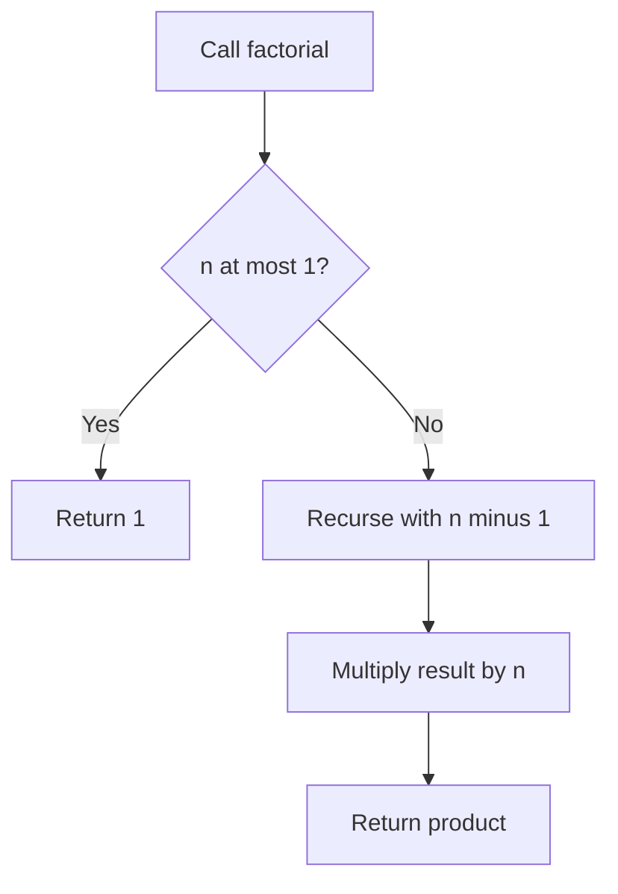

Big-O describes growth, not exact seconds.

| Complexity | Example |
|---|---|
| O(1) | List indexing |
| O(log n) | Binary search |
| O(n) | Full scan |
| O(n log n) | Comparison sorting |
| O(n²) | Compare all pairs |
| O(2ⁿ) | Enumerate all subsets |

Recursive factorial uses O(n) stack space. Counting O(n) recursive steps abstracts away the growing cost of big-integer multiplication.

Memoization avoids repeated subproblems:

```python
from functools import cache

@cache
def fibonacci(n: int) -> int:
    if n < 0:
        raise ValueError("n must be non-negative")
    if n < 2:
        return n
    return fibonacci(n - 1) + fibonacci(n - 2)

print(fibonacci(10))  # 55
```

Cached arguments must be hashable. Caches retain objects and need size/invalidation decisions; do not cache changing external state indiscriminately.

## 16. Modules, packages, and imports

A module is an importable unit, usually a `.py` file. A regular package is a directory with `__init__.py`; namespace packages are an exception. Imports execute top-level code on the first normal import and cache module objects in `sys.modules`.

File `math_tools.py`:

```python
def add(a, b):
    return a + b
```

File `main.py` beside it:

```python
from math_tools import add

def main():
    print(add(2, 3))

if __name__ == "__main__":
    main()
```

Run `python main.py`. The guard prevents running the entry point merely because the module is imported.

| Import | Use |
|---|---|
| `import math` | Qualified access: `math.sqrt` |
| `from math import sqrt` | Directly bind a name |
| `import statistics as stats` | Alias a module |
| `from .helpers import parse` | Relative package import |

Avoid wildcard imports and naming files after modules you need, such as `json.py`. Circular imports often indicate shared definitions belong in a lower-level module. Run package entry points with `python -m package.module` when appropriate.

## 17. Exceptions and error design

Exceptions interrupt normal flow and propagate up the call stack until handled. Catch an expected failure where meaningful recovery or translation is possible.

```python
def divide_text(a, b):
    try:
        result = float(a) / float(b)
    except ValueError:
        return "Inputs must be numeric"
    except ZeroDivisionError:
        return "Denominator cannot be zero"
    else:
        return result
    finally:
        print("Attempt completed")

print(divide_text("10", "2"))
```

`else` runs after a successful try body. `finally` runs as control leaves under ordinary language semantics; abrupt process termination can prevent cleanup. Avoid returning from `finally`, which can suppress exceptions or replace results.

| Exception | Typical cause |
|---|---|
| `TypeError` | Wrong type or signature |
| `ValueError` | Unsupported value |
| `IndexError` | Invalid sequence index |
| `KeyError` | Missing mapping key |
| `AttributeError` | Missing attribute |
| `FileNotFoundError` | Missing path |
| `ModuleNotFoundError` | Import cannot locate module |

```python
class InvalidScoreError(ValueError):
    """Score is invalid."""

def parse_score(text):
    try:
        score = int(text)
    except ValueError as exc:
        raise InvalidScoreError("Score must be an integer") from exc
    if not 0 <= score <= 100:
        raise InvalidScoreError("Score must be between 0 and 100")
    return score

print(parse_score("88"))
```

`raise ... from exc` preserves causality; bare `raise` re-raises the current exception. Avoid bare `except:` because it also catches termination-related exceptions.

Python 3.11+ exception groups represent several failures; `except*` handles matching members:

```python
try:
    raise ExceptionGroup("batch", [ValueError("bad value"), TypeError("bad type")])
except* ValueError as group:
    print("Value errors:", len(group.exceptions))
except* TypeError as group:
    print("Type errors:", len(group.exceptions))
```

Do not mix `except` and `except*` clauses on the same try statement.

## 18. Files, paths, and serialization

Use `pathlib` for paths and context managers for resource closure.

```python
from pathlib import Path
from tempfile import TemporaryDirectory

with TemporaryDirectory() as directory:
    path = Path(directory) / "notes.txt"
    path.write_text("Python\nFiles\n", encoding="utf-8")
    with path.open("r", encoding="utf-8") as handle:
        for line in handle:
            print(line.rstrip("\n"))
```

| Mode | Meaning |
|---|---|
| `r` | Read existing file |
| `w` | Write, truncating existing contents |
| `a` | Append or create |
| `x` | Create only, fail if present |
| `b` | Binary modifier, such as `rb` |
| `+` | Read/write update modifier |

Iterate large files instead of loading everything with `read()`. `seek` changes position and `tell` reports it; text positions have encoding-specific restrictions.

JSON supports objects, arrays, strings, numbers, Booleans, and null, not arbitrary Python classes or sets.

```python
import json

student = {"name": "Ajay", "active": True, "marks": [80, 90]}
text = json.dumps(student, ensure_ascii=False, indent=2, allow_nan=False)
restored = json.loads(text)
assert restored == student
```

`dump`/`load` use file objects; `dumps`/`loads` use strings. JSON keys are strings. Parsing verifies syntax, not business validity.

```python
import csv
import io

buffer = io.StringIO(newline="")
writer = csv.DictWriter(buffer, fieldnames=["name", "marks"])
writer.writeheader()
writer.writerow({"name": "Ajay", "marks": 88})
buffer.seek(0)
for row in csv.DictReader(buffer):
    print(row["name"], int(row["marks"]))
```

Open actual CSV files with `newline=""` and explicit encoding. CSV fields are read as text. `tomllib` reads TOML on Python 3.11+. YAML generally needs a third-party safe loader. Never load untrusted pickle data; deserialization can execute code. Compression is not encryption.

## 19. Useful standard-library modules

| Module | Purpose |
|---|---|
| `math`, `statistics` | Numerical functions and basic statistics |
| `decimal`, `fractions` | Decimal/rational arithmetic |
| `collections` | Counters, deques, grouped values |
| `itertools`, `functools` | Iterator and callable utilities |
| `datetime`, `zoneinfo` | Dates and named time zones |
| `pathlib`, `shutil`, `tempfile` | Filesystem operations |
| `heapq`, `bisect` | Heaps and sorted searches |
| `uuid`, `secrets`, `hashlib` | IDs, secure randomness, hashes |
| `argparse`, `subprocess` | CLIs and child processes |

```python
from collections import Counter, defaultdict, deque

print(Counter("banana").most_common(2))  # [('a', 3), ('n', 2)]
groups = defaultdict(list)
for name, course in [("Ajay", "Python"), ("Akash", "Python")]:
    groups[course].append(name)
print(dict(groups))
queue = deque(["first", "second"])
queue.append("third")
print(queue.popleft())  # first
```

A deque efficiently operates at both ends; a list suits frequent random indexing.

```python
from decimal import Decimal, ROUND_HALF_UP
from fractions import Fraction
import math

print(0.1 + 0.2 == 0.3)  # False
print(math.isclose(0.1 + 0.2, 0.3))  # True
print(Decimal("0.1") + Decimal("0.2"))  # 0.3
print(Decimal("12.345").quantize(Decimal("0.01"), rounding=ROUND_HALF_UP))
print(Fraction(1, 3) + Fraction(1, 6))  # 1/2
```

Create Decimal from strings to avoid importing a float's binary approximation. Define domain-specific precision and rounding.

```python
from datetime import datetime, timedelta, timezone
from zoneinfo import ZoneInfo

now = datetime.now(timezone.utc)
print(now.isoformat())
print((now + timedelta(days=7)).isoformat())
print(now.astimezone(ZoneInfo("Asia/Kolkata")))
```

Named zones require OS timezone data or the `tzdata` package. Aware datetimes include timezone information; naive ones do not. Store instants in aware UTC and convert for display. Use `time.perf_counter` for elapsed time, not wall-clock timestamps.

```python
from itertools import chain, combinations, islice
import heapq

print(list(chain([1, 2], [3])))
print(list(combinations("ABC", 2)))
print(list(islice(range(100), 3)))
heap = [5, 1, 3]
heapq.heapify(heap)
heapq.heappush(heap, 2)
print(heapq.heappop(heap))  # 1
```

A heap is not a fully sorted list. `itertools.groupby` groups consecutive keys; sort first for global grouping when needed.

## 20. Regular expressions

A regular expression describes a text pattern. Raw strings reduce backslash confusion.

| Pattern | Meaning |
|---|---|
| `.` | Any character except newline by default |
| `\d`, `\w`, `\s` | Digit, word, whitespace |
| `[A-Z]` | Character range |
| `*`, `+`, `?` | Zero or more, one or more, optional |
| `{m,n}` | Repetition bounds |
| `^`, `$` | Start/end anchors affected by modes |
| `(abc)` | Capturing group |
| `(?:abc)` | Non-capturing group |

```python
import re

print(re.findall(r"\d+", "Order 120 costs 450"))
print(re.sub(r"\s+", " ", "a   b\n c"))
pattern = re.compile(r"(?P<prefix>[A-Z]{2})-(?P<number>[0-9]{4})")
match = pattern.fullmatch("AB-1234")
if match:
    print(match.groupdict())
```

`search` scans anywhere; `match` starts at the beginning; `fullmatch` requires the whole string. `\d` includes Unicode decimal digits; use `[0-9]` for ASCII digits. Use dedicated parsers for HTML/JSON. Nested quantifiers on large untrusted text can cause pathological runtime.

## 21. Object-oriented programming

A class defines a type; an instance is an object of that type. Attributes hold state and methods provide operations. `self` conventionally names the instance passed automatically to an instance method.

```python
class BankAccount:
    bank_name = "Learning Bank"  # Class attribute

    def __init__(self, owner, balance=0):
        if balance < 0:
            raise ValueError("Opening balance cannot be negative")
        self.owner = owner
        self._balance = balance

    @property
    def balance(self):
        return self._balance

    def deposit(self, amount):
        if amount <= 0:
            raise ValueError("Deposit must be positive")
        self._balance += amount

    def withdraw(self, amount):
        if amount <= 0 or amount > self._balance:
            raise ValueError("Invalid withdrawal")
        self._balance -= amount

account = BankAccount("Ajay", 1000)
account.deposit(500)
account.withdraw(200)
print(account.balance)  # 1300
```

This example uses whole units; real money systems must define currency, precision, persistence, and transactions.

| OOP concept | Meaning |
|---|---|
| Encapsulation | Expose meaningful operations that protect state |
| Abstraction | Hide implementation details behind an interface |
| Inheritance | Derive behavior from another type |
| Polymorphism | Use different types through shared behavior |

`_name` indicates internal use by convention. `__name` triggers name mangling to reduce subclass name collisions, not security. Properties provide attribute syntax with controlled behavior. Create mutable per-instance collections in `__init__`, not as shared class attributes.

```python
class Temperature:
    def __init__(self, celsius):
        self.celsius = celsius

    @classmethod
    def from_fahrenheit(cls, value):
        return cls((value - 32) * 5 / 9)

    @staticmethod
    def is_valid_celsius(value):
        return value >= -273.15

    def as_fahrenheit(self):
        return self.celsius * 9 / 5 + 32

print(Temperature.from_fahrenheit(212).celsius)  # 100.0
```

Instance methods receive `self`, class methods receive `cls`, static methods receive neither automatically. Class methods are useful for alternative constructors that respect subclasses.

## 22. Inheritance, composition, and abstraction

Inheritance models an is-a relationship. Composition models an object using or containing another object and often makes dependencies easier to replace.

```python
from abc import ABC, abstractmethod

class Notifier(ABC):
    @abstractmethod
    def send(self, message):
        """Deliver a message."""

class ConsoleNotifier(Notifier):
    def send(self, message):
        print(f"NOTICE: {message}")

class EnrollmentService:
    def __init__(self, notifier):
        self.notifier = notifier

    def enroll(self, name):
        self.notifier.send(f"Enrolled {name}")

EnrollmentService(ConsoleNotifier()).enroll("Ajay")
```

An abstract class with unresolved abstract methods cannot be instantiated. Duck typing can use compatible behavior without explicit inheritance.

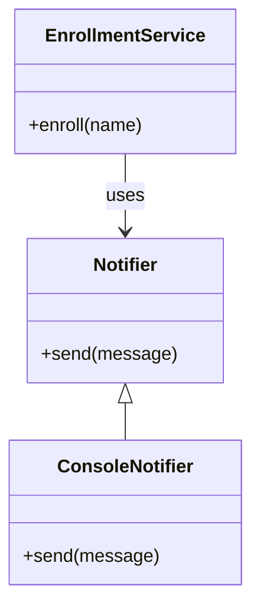

```python
class Person:
    def __init__(self, name):
        self.name = name

class Student(Person):
    def __init__(self, name, roll):
        super().__init__(name)
        self.roll = roll

student = Student("Ajay", 256307)
print(student.name, student.roll)
print(Student.__mro__)
```

`super()` continues lookup along the method resolution order, not just a hard-coded parent. Python uses C3 linearization for multiple inheritance. Cooperative methods need compatible signatures and appropriate `super()` calls.

Defining a method name twice replaces the first definition; Python does not perform Java-style signature overloading automatically. Use defaults, different names, or explicit dispatch.

## 23. Special methods and the data model

Special methods connect custom types to Python syntax. Implement operations whose meaning is natural for the type.

```python
from dataclasses import dataclass

@dataclass(frozen=True)
class Vector:
    x: float
    y: float

    def __add__(self, other):
        if not isinstance(other, Vector):
            return NotImplemented
        return Vector(self.x + other.x, self.y + other.y)

    def __abs__(self):
        return (self.x ** 2 + self.y ** 2) ** 0.5

print(Vector(1, 2) + Vector(3, 4))  # Vector(x=4, y=6)
print(abs(Vector(3, 4)))           # 5.0
```

| Method | Used by |
|---|---|
| `__new__` | Object creation |
| `__init__` | Initialization |
| `__repr__` | Developer representation |
| `__str__` | User-facing text |
| `__len__`, `__bool__` | Length and truth testing |
| `__iter__`, `__next__` | Iteration |
| `__getitem__`, `__contains__` | Indexing and membership |
| `__call__` | Calling an object |
| `__eq__`, `__lt__` | Comparisons |
| `__enter__`, `__exit__` | Context management |

Return `NotImplemented` for unsupported operand combinations to permit fallback dispatch. It differs from raising `NotImplementedError`. Equal hashable objects must have equal hashes. Mutable value objects are usually best left unhashable. `__init__` must return `None`. Special-method lookup commonly occurs on the type rather than the instance dictionary.

## 24. Dataclasses and enums

Dataclasses generate routine methods from annotated fields, including initialization, representation, and equality. They do not automatically check annotated types.

```python
from dataclasses import dataclass, field, asdict
from enum import Enum

class Status(Enum):
    OPEN = "open"
    DONE = "done"

@dataclass(slots=True)
class Task:
    title: str
    status: Status = Status.OPEN
    tags: list[str] = field(default_factory=list)

    def __post_init__(self):
        if not self.title.strip():
            raise ValueError("Title cannot be blank")

first = Task("Learn Python")
second = Task("Write tests")
first.tags.append("study")
print(second.tags)  # []
print(asdict(first))
```

`default_factory` creates separate mutable defaults. `frozen=True` prevents ordinary field rebinding but does not freeze nested lists. `slots=True` can reduce storage overhead and usually prevents arbitrary new instance attributes, subject to inheritance.

Enums define named alternatives. `Status("done")` retrieves the matching member, while an unknown value raises `ValueError`.

## 25. Iterators and generators

An iterable can provide an iterator through `iter()`. An iterator provides values through `next()` and raises `StopIteration` when exhausted. Lists can provide new iterators repeatedly; a generator is normally consumed once.

```python
iterator = iter([10, 20])
print(next(iterator))        # 10
print(next(iterator))        # 20
print(next(iterator, None))  # None

class Countdown:
    def __init__(self, start):
        self.current = start

    def __iter__(self):
        return self

    def __next__(self):
        if self.current <= 0:
            raise StopIteration
        value = self.current
        self.current -= 1
        return value

print(list(Countdown(3)))  # [3, 2, 1]
```

A function containing `yield` creates a generator. The body starts when advanced, suspending at each yield while retaining local state.

```python
def countdown(start):
    while start > 0:
        yield start
        start -= 1

def flatten_once(groups):
    for group in groups:
        yield from group

print(list(countdown(3)))
print(list(flatten_once([[1, 2], [3]])))
```

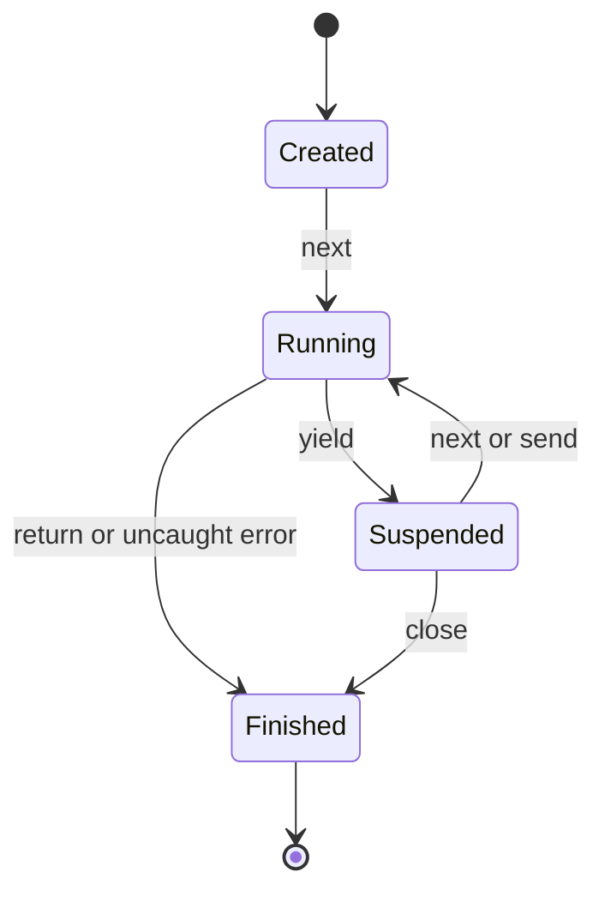

Generators support streaming, but wrapping one in `list()` still collects every result. Advanced methods include `send`, `throw`, and `close`. Start a generator before sending a non-None value. End a generator with `return`, not an explicit `raise StopIteration`.

```python
def receiver():
    value = yield "ready"
    yield value * 2

gen = receiver()
print(next(gen))    # ready
print(gen.send(5))  # 10
```

## 26. Decorators

A decorator accepts a function/class and returns a replacement or modified object. `@decorate` means approximately `function = decorate(function)`.

```python
from functools import wraps
from time import perf_counter

def timed(func):
    @wraps(func)
    def wrapper(*args, **kwargs):
        start = perf_counter()
        try:
            return func(*args, **kwargs)
        finally:
            print(f"{func.__name__}: {perf_counter() - start:.6f}s")
    return wrapper

@timed
def total_up_to(n):
    return sum(range(n + 1))

print(total_up_to(100))  # Timing line, then 5050
```

`wraps` preserves metadata and links to the original callable. This synchronous wrapper does not measure completion of an async coroutine; an async wrapper must await it.

```python
from functools import wraps

def require_minimum(minimum):
    def decorate(func):
        @wraps(func)
        def wrapper(value):
            if value < minimum:
                raise ValueError(f"Value must be at least {minimum}")
            return func(value)
        return wrapper
    return decorate

@require_minimum(0)
def square(value):
    return value * value

print(square(4))  # 16
```

Stacked decorators apply bottom-up: `@a` above `@b` becomes `a(b(function))`. Uses include caching, instrumentation, registration, and authorization. Keep hidden state and side effects limited.

## 27. Context managers

`with` provides scoped resource management. `__enter__` supplies the value after `as`; `__exit__` handles cleanup and can suppress an exception if it returns a truthy value.

```python
from contextlib import contextmanager
from time import perf_counter

@contextmanager
def measure(label):
    start = perf_counter()
    try:
        yield
    finally:
        print(f"{label}: {perf_counter() - start:.6f}s")

with measure("calculation"):
    result = sum(range(1000))
print(result)  # 499500
```

A generator decorated with `contextmanager` must yield exactly once. Setup occurs before yield and exit handling after it. Use `finally` for cleanup after exceptions. `ExitStack` manages a dynamic number of resources. Async equivalents use `async with`, `__aenter__`, `__aexit__`, or `asynccontextmanager`.

## 28. Type hints and protocols

Hints communicate expected types to developers and static analyzers. They do not enforce runtime validation by themselves.

```python
from typing import Protocol, TypedDict, TypeVar

class StudentData(TypedDict):
    name: str
    marks: int

class Sender(Protocol):
    def send(self, message: str) -> None: ...

class ConsoleSender:
    def send(self, message: str) -> None:
        print(message)

def notify(sender: Sender, message: str) -> None:
    sender.send(message)

T = TypeVar("T")

def first(items: list[T]) -> T:
    if not items:
        raise ValueError("Empty input")
    return items[0]

notify(ConsoleSender(), "Ready")
print(first([1, 2]))
```

Protocols describe structural contracts without requiring inheritance. TypedDict describes dictionary shape to static tools but remains a dictionary at runtime.

| Annotation | Meaning |
|---|---|
| `list[str]` | List of strings |
| `dict[str, int]` | String keys and integer values |
| `str \| None` | String or no value |
| `tuple[int, str]` | Fixed pair |
| `tuple[int, ...]` | Arbitrary-length integer tuple |
| `Callable[[int], str]` | Callable signature |
| `Literal["open", "done"]` | Specific allowed literal alternatives |
| `Any` | Bypass many static checks |
| `object` | Any object, with only known object operations allowed |

Prefer `Iterable`, `Sequence`, or `Mapping` inputs when concrete containers are unnecessary. `cast` informs static tools without conversion/checking. `ParamSpec` preserves callable parameter types in decorators. Overload declarations describe signatures while a single runtime implementation handles them.

```python
# Python 3.12+
type UserId = int

def identity[T](value: T) -> T:
    return value
```

Use TypeVar and assignment aliases for older versions.

## 29. Descriptors and attribute access

Descriptors are objects stored on classes that implement attribute access hooks. They underlie methods, properties, and many ORM fields.

```python
class NonNegative:
    def __set_name__(self, owner, name):
        self.storage_name = "_" + name

    def __get__(self, instance, owner=None):
        if instance is None:
            return self
        return getattr(instance, self.storage_name)

    def __set__(self, instance, value):
        if value < 0:
            raise ValueError("Value cannot be negative")
        setattr(instance, self.storage_name, value)

class Product:
    price = NonNegative()

    def __init__(self, price):
        self.price = price

product = Product(50)
product.price = 75
print(product.price)  # 75
```

Under standard instance lookup, data descriptors take precedence over the instance dictionary, followed by non-data descriptors/class attributes, then a missing-attribute fallback. A data descriptor defines setting or deletion; a non-data descriptor defines only `__get__`.

`__getattribute__` participates in every ordinary attribute lookup; `__getattr__` is a missing-attribute fallback. Override carefully and delegate to `object.__getattribute__` to avoid recursion. Prefer a property unless reusable field behavior justifies a descriptor.

## 30. Metaclasses and introspection

Classes are objects too; `type` is the usual metaclass creating them. Most application needs are better served by class decorators or `__init_subclass__` than custom metaclasses.

```python
class Plugin:
    registry = {}

    def __init_subclass__(cls, *, key, **kwargs):
        super().__init_subclass__(**kwargs)
        if key in Plugin.registry:
            raise ValueError("Duplicate key")
        Plugin.registry[key] = cls

class CSVPlugin(Plugin, key="csv"):
    pass

print(Plugin.registry["csv"].__name__)  # CSVPlugin
```

A minimal class-creation validation example:

```python
class RequireRun(type):
    def __new__(mcls, name, bases, namespace):
        if name != "BaseJob" and not callable(namespace.get("run")):
            raise TypeError("Each job must define run()")
        return super().__new__(mcls, name, bases, namespace)

class BaseJob(metaclass=RequireRun):
    pass

class ReportJob(BaseJob):
    def run(self):
        return "report"

print(ReportJob().run())
```

This deliberately requires direct definition in each subclass. An abstract base class usually models inherited interface requirements better. Introspection uses `type`, `isinstance`, `getattr`, `vars`, `dir`, and `inspect.signature`. Attribute access may execute properties/descriptors, so introspection is not necessarily side-effect-free.

## 31. Memory, copying, and garbage collection

Objects remain alive while reachable. Traditional CPython uses reference counting and cyclic garbage collection; these are implementation details rather than universal language guarantees. Manage external resources explicitly with context managers.

```python
from copy import copy, deepcopy

original = [[1, 2], [3, 4]]
shallow = copy(original)
deep = deepcopy(original)
original[0].append(9)
print(shallow)  # [[1, 2, 9], [3, 4]]
print(deep)     # [[1, 2], [3, 4]]
```

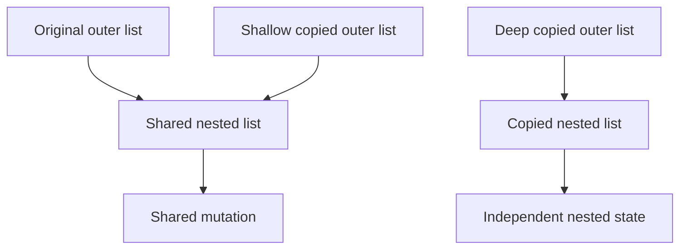

`del name` removes a binding, not necessarily the object. `sys.getsizeof` is shallow. Use `tracemalloc` to investigate Python allocations. Unbounded caches, global collections, callbacks, and pending tasks can retain unwanted objects. `weakref` supplies non-owning references for eligible objects. Avoid `__del__` for essential cleanup.

## 32. Concurrency, parallelism, and the GIL

Concurrency means overlapping progress; parallelism means simultaneous execution on multiple resources.

| Model | Good starting use | Main cost/risk |
|---|---|---|
| Threads | Blocking I/O | Shared-state races |
| Processes | Substantial CPU-heavy Python work | Startup and serialization |
| Asyncio | Many cooperative I/O operations | Blocking the loop |
| Native/vectorized libraries | Numerical batches | Library-specific memory/thread behavior |

In ordinary GIL-enabled CPython, the Global Interpreter Lock limits simultaneous Python-code execution by threads in one interpreter. I/O can overlap and native extensions may release the GIL. The GIL does not make compound application operations thread-safe.

Free-threaded builds may run with the GIL disabled, but compatible extensions and explicit synchronization remain important. Do not assume every installation uses this mode. See the [official free-threading guide](https://docs.python.org/3/howto/free-threading-python.html).

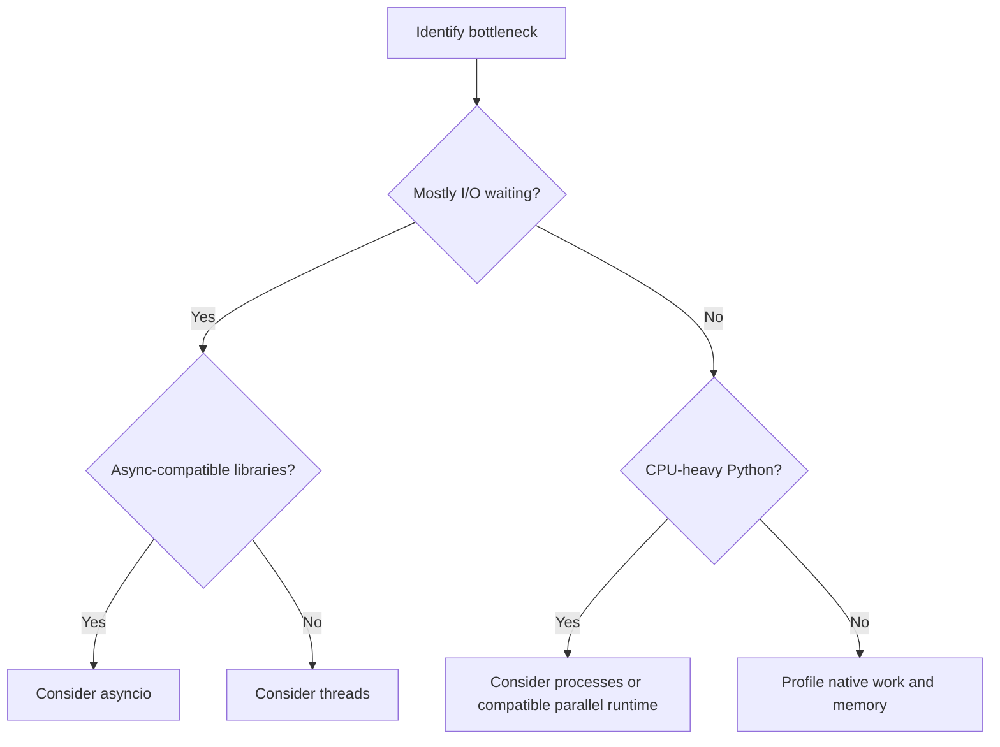

Small workloads may be faster sequentially because concurrency adds overhead.

## 33. Threads and synchronization

Threads share memory. Protect multi-step invariants or use queues to reduce shared mutable state.

```python
from concurrent.futures import ThreadPoolExecutor
from threading import Lock

counter = 0
lock = Lock()

def increment_many(repetitions):
    global counter
    for _ in range(repetitions):
        with lock:
            counter += 1

with ThreadPoolExecutor(max_workers=4) as executor:
    list(executor.map(increment_many, [1000] * 4))
print(counter)  # 4000
```

`counter += 1` is a read-modify-write operation. Protect the entire invariant instead of relying on interpreter accidents.

| Primitive | Purpose |
|---|---|
| Lock | Mutual exclusion |
| RLock | Recursive acquisition by one thread |
| Event | Signal such as shutdown |
| Condition | Wait for protected state changes |
| Semaphore | Bound simultaneous access |
| queue.Queue | Thread-safe communication |

Deadlocks can arise when lock acquisition orders conflict. Use consistent ordering and avoid slow I/O under locks where possible. A future timeout does not forcibly terminate an already running thread; design cooperative cancellation.

## 34. Processes and executors

Processes have separate memory and can execute CPU work across cores. Inputs/results often need serialization; worker functions should normally be importable top-level functions.

Save as `process_demo.py` and run as a script:

```python
from concurrent.futures import ProcessPoolExecutor

def sum_squares(limit):
    return sum(n * n for n in range(limit))

def main():
    with ProcessPoolExecutor(max_workers=2) as executor:
        print(list(executor.map(sum_squares, [10000, 20000])))

if __name__ == "__main__":
    main()
```

The guard prevents recursive startup under spawn-based execution. Do not assume the same default start method across platforms/releases. Notebook-local functions and lambdas can fail serialization/import requirements.

A Future represents an eventual result; `.result()` waits and re-raises worker exceptions. `as_completed` yields completion order, while `map` preserves input order. Batch small work so scheduling/serialization does not dominate.

## 35. Asyncio and structured concurrency

Calling an `async def` function creates a coroutine object; it does not execute it to completion. `await` can suspend so other tasks progress.

```python
import asyncio

async def fetch_simulated(name, delay):
    await asyncio.sleep(delay)
    return f"Result {name}"

async def main():
    async with asyncio.TaskGroup() as group:
        first = group.create_task(fetch_simulated("A", 0.02))
        second = group.create_task(fetch_simulated("B", 0.01))
    print(first.result())
    print(second.result())

if __name__ == "__main__":
    asyncio.run(main())
```

TaskGroup scopes task lifetimes. A non-cancellation failure ordinarily cancels siblings and reports grouped failures after cleanup. In a notebook with an existing loop, use `await main()`. See [coroutines and tasks](https://docs.python.org/3/library/asyncio-task.html).

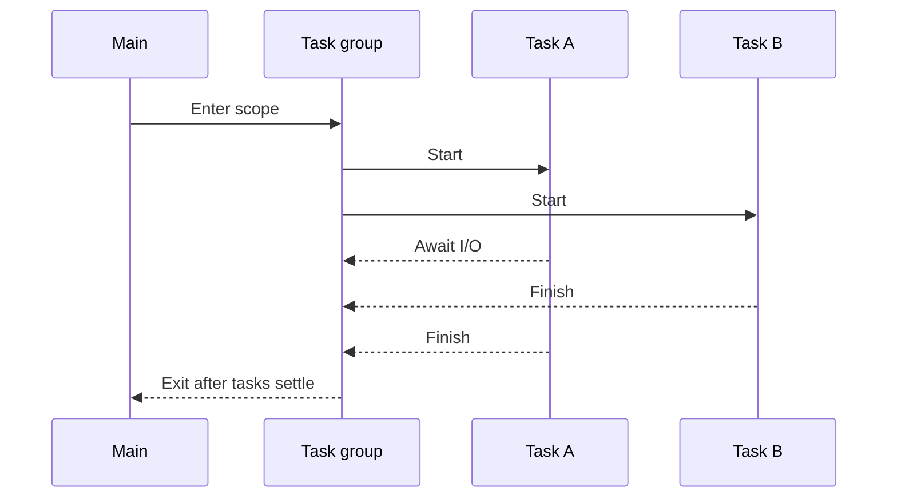

```python
import asyncio

async def limited_work(semaphore, value):
    async with semaphore:
        async with asyncio.timeout(1):
            await asyncio.sleep(0.01)
            return value * 2

async def main():
    semaphore = asyncio.Semaphore(2)
    results = await asyncio.gather(*(limited_work(semaphore, n) for n in range(5)))
    print(results)  # [0, 2, 4, 6, 8]

if __name__ == "__main__":
    asyncio.run(main())
```

Never use blocking sleeps or blocking network calls directly inside the loop. `asyncio.to_thread` can delegate suitable blocking I/O; it does not automatically parallelize Python CPU work on GIL-enabled builds.

Cancellation is cooperative. Clean up in `finally` and normally re-raise `CancelledError` if caught. A semaphore limits active work, not total allocated task objects; huge streams need bounded queues/workers. Async generators combine `async def` and `yield`; consumers use `async for`. `ContextVar` supports context-local request metadata; reset tokens after scoped use.

## 36. Testing and debugging

Unit tests check isolated behavior, integration tests check connected components, and end-to-end tests check complete workflows.

File `calculator.py`:

```python
def average(values):
    if not values:
        raise ValueError("At least one value is required")
    return sum(values) / len(values)
```

File `test_calculator.py`:

```python
import unittest
from calculator import average

class AverageTests(unittest.TestCase):
    def test_normal(self):
        self.assertEqual(average([2, 4, 6]), 4)

    def test_fraction(self):
        self.assertAlmostEqual(average([1, 2]), 1.5)

    def test_empty(self):
        with self.assertRaises(ValueError):
            average([])

if __name__ == "__main__":
    unittest.main()
```

Run `python -m unittest discover -v`. Test boundaries, invalid input, and regressions. Make clock/random/network dependencies controllable. Use temporary files/databases.

Third-party pytest alternative, installed with `python -m pip install pytest`:

```python
import pytest
from calculator import average

@pytest.mark.parametrize("values, expected", [([2, 4], 3), ([5], 5)])
def test_average(values, expected):
    assert average(values) == expected

def test_empty():
    with pytest.raises(ValueError):
        average([])
```

Mocks replace boundary dependencies; patch where the tested code looks up the name. Excessive mocking can hide real integration failures.

Debug by reproducing a minimal failure, reading the traceback, inspecting state, fixing the cause, and retaining a regression test. `breakpoint()` enters the debugger. Pdb commands include `n` next, `s` step, `c` continue, `p expression`, `bt` stack, and `q` quit. Assertions can be removed by optimized execution; use explicit checks for input validation and security.

## 37. Logging and configuration

Logging levels are DEBUG, INFO, WARNING, ERROR, and CRITICAL. Create named loggers per module and configure handlers at the application boundary.

```python
import logging
import os

logging.basicConfig(level=logging.INFO, format="%(levelname)s %(name)s %(message)s")
logger = logging.getLogger(__name__)
port = int(os.environ.get("APP_PORT", "8000"))
logger.info("Configured port %s", port)
try:
    int("invalid")
except ValueError:
    logger.exception("Failed to parse demonstration value")
```

Parameterized logging avoids unnecessary string formatting. `logger.exception` includes the current traceback. Validate configuration early; missing and empty variables are different. Python does not load `.env` automatically without supporting code/tools. Keep secrets out of logs. For services, record request IDs, durations, and statuses with appropriate retention and redaction.

## 38. Databases and transactions

Relational databases use tables, keys, constraints, and relationships. Transactions group changes that commit together or roll back. SQLite is included with Python and useful for local tools and many single-host applications.

```python
import sqlite3
from contextlib import closing

with closing(sqlite3.connect(":memory:")) as connection:
    with connection:
        connection.execute("""
            CREATE TABLE students (
                id INTEGER PRIMARY KEY,
                name TEXT NOT NULL,
                marks INTEGER NOT NULL CHECK(marks BETWEEN 0 AND 100)
            )
        """)
        connection.execute(
            "INSERT INTO students(name, marks) VALUES (?, ?)", ("Ajay", 88)
        )
    rows = connection.execute(
        "SELECT name, marks FROM students WHERE marks >= ?", (75,)
    ).fetchall()
    print(rows)  # [('Ajay', 88)]
```

The connection context handles transactions under its configured mode but does not close the connection; `closing` handles closure. Driver/autocommit configuration affects behavior.

Bind SQL values with placeholders. Drivers vary in placeholder syntax. Parameters represent values, not table/column identifiers; allowlist dynamic identifiers. An ORM does not remove the need to understand SQL and transactions.

| Concept | Purpose |
|---|---|
| Primary key | Unique row identity |
| Foreign key | Relationship constraint |
| Index | Faster lookups with write/storage cost |
| Join | Combine related rows |
| Migration | Version-controlled schema changes |
| Connection pool | Bounded connection reuse |

ACID means atomicity, consistency, isolation, durability; exact guarantees depend on the database/configuration. Avoid N+1 queries and add indexes based on actual query patterns.

## 39. HTTP, APIs, and backend architecture

HTTP requests use methods, URLs, headers, and bodies. GET reads, POST submits/creates, PUT replaces, PATCH partially updates, and DELETE removes by conventional API semantics. Document idempotency and error behavior.

| Status | Common meaning |
|---|---|
| 200 / 201 / 204 | Success / created / no response body |
| 400 | Invalid request |
| 401 / 403 | Invalid authentication / insufficient permission |
| 404 | Resource unavailable at route |
| 409 | State conflict |
| 429 | Rate limit exceeded |
| 500 | Unexpected server failure |

Standard-library HTTP example, requiring internet:

```python
import json
from urllib.request import Request, urlopen
from urllib.error import HTTPError, URLError

request = Request("https://httpbin.org/json", headers={"Accept": "application/json"})
try:
    with urlopen(request, timeout=10) as response:
        data = json.load(response)
        print(type(data).__name__)
except HTTPError as exc:
    print("HTTP status:", exc.code)
except URLError as exc:
    print("Network error:", exc.reason)
```

Set timeouts, validate responses, and bound untrusted response sizes. Retry only when safe: repeated creation requests can duplicate work.

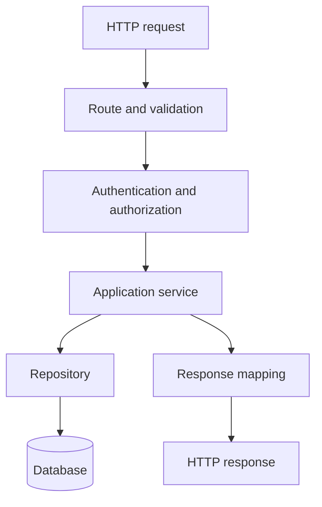

Keep business rules in services/domain functions, persistence in repositories, and HTTP translation at routes. Layer count should fit project complexity.

Minimal FastAPI example: install `python -m pip install fastapi "uvicorn[standard]"`, then save as `api.py`:

```python
from fastapi import FastAPI
from pydantic import BaseModel, Field

app = FastAPI(title="Student Score API")

class ScoreInput(BaseModel):
    name: str = Field(min_length=1, max_length=80)
    marks: int = Field(ge=0, le=100)

@app.get("/health")
def health():
    return {"status": "ok"}

@app.post("/scores/evaluate")
def evaluate_score(score: ScoreInput):
    return {"name": score.name, "passed": score.marks >= 40}
```

Run `python -m uvicorn api:app --reload` and open `http://127.0.0.1:8000/docs`. Reload is for development. This is a validation demonstration without auth or persistence. Pydantic may coerce values by default; choose strict validation when needed. See the [FastAPI request-body guide](https://fastapi.tiangolo.com/tutorial/body/).

Backend learning should also cover authentication, authorization, pagination, migrations, limits, observability, API tests, and deployment. Django, Flask, and FastAPI offer different levels of built-in structure.

## 40. Command-line tools and subprocesses

Argparse validates command-line shape and generates help.

```python
import argparse

def main():
    parser = argparse.ArgumentParser(description="Greet a user")
    parser.add_argument("name")
    parser.add_argument("--repeat", type=int, default=1)
    args = parser.parse_args()
    if args.repeat < 1:
        parser.error("--repeat must be positive")
    for _ in range(args.repeat):
        print(f"Hello, {args.name}!")

if __name__ == "__main__":
    main()
```

Save as `greet.py`; run `python greet.py Ajay --repeat 2`.

```python
import subprocess
import sys

result = subprocess.run(
    [sys.executable, "-c", "print(2 + 3)"],
    check=True, capture_output=True, text=True, timeout=5,
)
print(result.stdout.strip())  # 5
```

Use argument lists and avoid a shell unless required. Validate arguments even without a shell; a command's `--` separator can prevent option injection where supported. `check=True` raises for nonzero exit codes. Timeouts raise `TimeoutExpired`. Stream large outputs rather than buffering them without limits.

## 41. Packaging and project structure

| Path | Responsibility |
|---|---|
| `pyproject.toml` | Project/build/tool metadata |
| `README.md` | Setup and usage |
| `src/study_tools/__init__.py` | Package marker |
| `src/study_tools/cli.py` | Entry point |
| `src/study_tools/service.py` | Application logic |
| `tests/test_service.py` | Behavioral tests |
| `.gitignore` | Exclude environments, caches, secrets |

Example metadata:

```toml
[build-system]
requires = ["setuptools>=68"]
build-backend = "setuptools.build_meta"

[project]
name = "study-tools-example"
version = "0.1.0"
description = "A learning CLI"
requires-python = ">=3.11"
dependencies = []

[project.optional-dependencies]
dev = ["pytest", "ruff", "mypy"]

[project.scripts]
study-tools = "study_tools.cli:main"

[tool.setuptools.packages.find]
where = ["src"]
```

Create the listed source files and define `main` in `cli.py` before installing.

```bash
python -m pip install -e ".[dev]"
python -m pytest
python -m ruff check .
python -m mypy src
python -m pip install build
python -m build
```

Editable installation points development imports at source. Wheels are built distributions; sdists package source for building. Dependency metadata is not a complete reproducible-deployment lock. Building locally does not publish a package. See the [Packaging User Guide](https://packaging.python.org/en/latest/tutorials/packaging-projects/).

Use CI to run tests and static checks on supported Python versions. Keep production configuration outside source, stop gracefully, and document how to roll back a release.

## 42. Performance and profiling

Measure before optimizing. Improve algorithms and representations before micro-optimizations.

```python
from timeit import timeit

list_time = timeit("9999 in values", setup="values = list(range(10000))", number=1000)
set_time = timeit("9999 in values", setup="values = set(range(10000))", number=1000)
print(list_time, set_time)
```

This excludes construction costs to isolate repeated membership. Real benchmarks must include workload-relevant setup, memory, and I/O. One run is not a universal speed guarantee.

Use `python -m cProfile -s cumulative program.py` for function profiling and `tracemalloc` for Python allocations. Native allocations may need other tools.

| Technique | Benefit | Tradeoff |
|---|---|---|
| Set/dict lookup | Faster repeated membership | Memory |
| Generators | Streaming | One-pass consumption |
| Batching | Fewer I/O calls | Latency and batch sizing |
| Caching | Avoid repeated work | Staleness and retention |
| Vectorization | Native numerical work | Dtypes and temporary arrays |
| Processes | CPU parallelism | Serialization/startup |

Python integers grow rather than silently overflowing, but large arithmetic costs more. Native numerical arrays may use fixed-width types with different overflow rules.

## 43. Security and reliability

- Validate input shape, type, range, size, and allowed values.
- Parameterize SQL and escape output for its actual context.
- Never run untrusted input through eval, exec, or pickle loading.
- Use `secrets` for unpredictable tokens, not `random`.
- Store passwords through maintained password-hashing libraries, not plain fast hashes.
- Keep credentials out of Git, logs, errors, and client responses.
- Check authorization for each protected action/object.
- Use timeouts, bounded concurrency, and resource limits.
- Retry with bounded backoff only when operation semantics permit it.
- Audit and update dependencies through a tested process.

```python
import secrets
import hmac

issued = secrets.token_urlsafe(32)
provided = issued
print(hmac.compare_digest(issued, provided))  # True
```

Tokens also need expiration, scope, storage, and revocation rules. SHA-256 is useful for checksums but is not a complete password-storage scheme.

```python
from pathlib import Path

def resolve_child(base: Path, user_path: str) -> Path:
    root = base.resolve()
    candidate = (root / user_path).resolve()
    if not candidate.is_relative_to(root):
        raise ValueError("Path escapes allowed directory")
    return candidate
```

This checks path containment but is not a complete filesystem sandbox; malicious symlink races require stronger OS-level defenses. Reliability includes transactions, idempotency, graceful shutdown, clear errors, and tested backups where persistent data matters.

## 44. Advanced architecture and language techniques

Dependency injection means passing dependencies into services instead of constructing them internally. A service can use a real repository in production and an in-memory fake in tests. Separate pure validation/calculation from I/O to reduce expensive integration-test requirements.

```python
from functools import singledispatch

@singledispatch
def describe(value):
    return f"Object: {value}"

@describe.register
def _(value: int):
    return f"Integer: {value}"

@describe.register
def _(value: list):
    return f"List with {len(value)} items"

print(describe(5))
print(describe([1, 2]))
```

Single dispatch selects by the first argument's runtime type; it is not arbitrary multiple dispatch.

| Principle | Practical meaning |
|---|---|
| Single responsibility | Focus reasons for change |
| Open/closed | Add behavior through appropriate extension points |
| Substitution | Subtypes preserve expected contracts |
| Interface segregation | Require only operations consumers need |
| Dependency inversion | High-level policy uses abstractions |

Strategy, adapter, factory, and repository name recurring designs; use them when they simplify an actual problem. A function can be a strategy without an extra class hierarchy.

Further mechanisms include slots for storage control, weak references, AST-based tools, plugin entry points, and native extensions. AST parsing is not safe execution. Native bindings introduce ABI, build, and memory-safety concerns.

```python
buffer = bytearray(b"abcd")
view = memoryview(buffer)
view[0] = ord("z")
print(buffer)  # bytearray(b'zbcd')
view.release()
```

Memoryview can access supported binary buffers without copying their contents. Advanced metaprogramming should solve concrete needs because it can weaken static analysis and obscure failures.

## 45. Modern Python version notes

New syntax fails during parsing on older interpreters, before a runtime version check can protect it.

| Version | Selected additions |
|---|---|
| 3.10 | Pattern matching, union annotations, strict zip |
| 3.11 | TaskGroup, exception groups, asyncio.timeout, tomllib |
| 3.12 | Type-parameter and type-alias syntax |
| 3.13 | Optional experimental free-threaded builds |
| 3.14 | Template strings, deferred annotations, interpreter pools |

Python 3.14 t-strings retain literal/interpolation components in a Template instead of immediately returning str. A processor determines rendering; t-strings do not automatically sanitize HTML or SQL. Python 3.14 also changes annotation evaluation and adds InterpreterPoolExecutor. See the [official release notes](https://docs.python.org/3/whatsnew/3.14.html).

```python
# Python 3.14+
name = "Ajay"
template = t"Hello, {name}!"
print(template.strings)  # ('Hello, ', '!')
print(template.values)   # ('Ajay',)
```

Interpreter pools and processes have different isolation/data-transfer constraints. Check native-extension compatibility. Optional JIT/free-threading are build/runtime choices; benchmark instead of assuming they are enabled or faster.

## 46. Data science and specialist directions

| Direction | Concepts | Ecosystem examples |
|---|---|---|
| Numerical computing | Arrays, broadcasting, dtypes | NumPy, SciPy |
| Data analysis | Missing data, joins, grouping | pandas |
| Visualization | Chart choice, uncertainty | Matplotlib, Plotly |
| Machine learning | Splits, leakage, evaluation | scikit-learn, PyTorch |
| Web | HTTP, persistence, auth | Django, Flask, FastAPI |
| Browser testing | Selectors, waits, assertions | Playwright, Selenium |
| Desktop GUI | Events, state, layout | Tkinter, Qt bindings |

NumPy example; install with `python -m pip install numpy`:

```python
import numpy as np

marks = np.array([70, 80, 90], dtype=float)
print(marks.mean())       # 80.0
print(marks + 5)          # [75. 85. 95.]
print(marks[marks >= 80]) # [80. 90.]
```

Lists and arrays have different arithmetic: multiplying a list repeats elements, while a NumPy array scales values.

Pandas example; install with `python -m pip install pandas`:

```python
import pandas as pd

frame = pd.DataFrame({"course": ["Python", "Python", "Java"], "marks": [80, 90, 70]})
print(frame.groupby("course")["marks"].mean())
```

For ML, split training/validation/test data, fit preprocessing only on training data, and select metrics for imbalance and error costs. Library syntax does not replace statistical understanding.

## 47. Complete project: SQLite task manager

This standard-library Python 3.11+ project combines CLI parsing, classes, dataclasses, enums, validation, SQL parameters, transactions, and tests. It adds/lists/completes tasks in a local file. It is a single-user learning CLI, not a multi-user service.

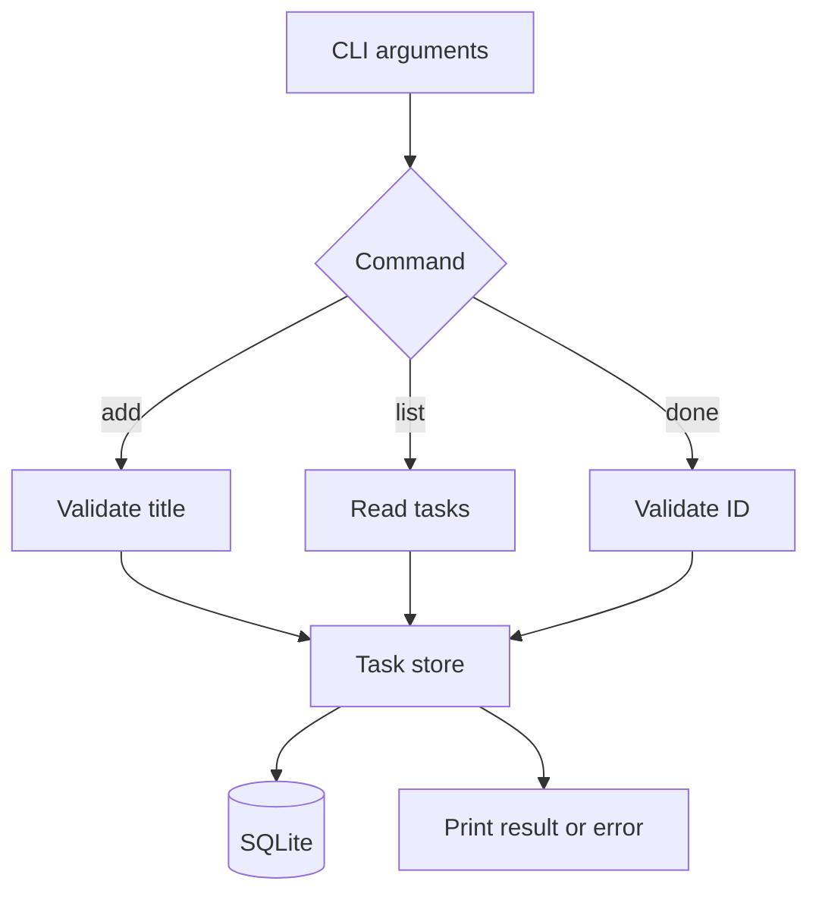

Save as `task_manager.py`:

```python
from __future__ import annotations

import argparse
import sqlite3
import sys
from contextlib import closing
from dataclasses import dataclass
from enum import Enum
from pathlib import Path


class Status(str, Enum):
    OPEN = "open"
    DONE = "done"


@dataclass(frozen=True)
class Task:
    id: int
    title: str
    status: Status


class TaskStore:
    def __init__(self, connection: sqlite3.Connection):
        self.connection = connection
        self.connection.row_factory = sqlite3.Row
        with self.connection:
            self.connection.execute("""
                CREATE TABLE IF NOT EXISTS tasks (
                    id INTEGER PRIMARY KEY,
                    title TEXT NOT NULL CHECK(length(trim(title)) BETWEEN 1 AND 120),
                    status TEXT NOT NULL DEFAULT 'open'
                        CHECK(status IN ('open', 'done'))
                )
            """)

    def add(self, title: str) -> Task:
        clean_title = title.strip()
        if not 1 <= len(clean_title) <= 120:
            raise ValueError("Title must contain 1 to 120 characters")
        with self.connection:
            cursor = self.connection.execute(
                "INSERT INTO tasks(title) VALUES (?)", (clean_title,)
            )
            task_id = cursor.lastrowid
        if task_id is None:
            raise RuntimeError("Database did not return a task ID")
        return Task(task_id, clean_title, Status.OPEN)

    def list_tasks(self, only_open: bool = False) -> list[Task]:
        if only_open:
            rows = self.connection.execute(
                "SELECT id, title, status FROM tasks WHERE status = ? ORDER BY id",
                (Status.OPEN.value,),
            ).fetchall()
        else:
            rows = self.connection.execute(
                "SELECT id, title, status FROM tasks ORDER BY id"
            ).fetchall()
        return [Task(row["id"], row["title"], Status(row["status"])) for row in rows]

    def mark_done(self, task_id: int) -> None:
        if task_id <= 0:
            raise ValueError("Task ID must be positive")
        with self.connection:
            cursor = self.connection.execute(
                "UPDATE tasks SET status = ? WHERE id = ?",
                (Status.DONE.value, task_id),
            )
            if cursor.rowcount == 0:
                raise LookupError(f"Task {task_id} does not exist")


def build_parser() -> argparse.ArgumentParser:
    parser = argparse.ArgumentParser(description="Manage your study tasks")
    parser.add_argument("--db", type=Path, default=Path("tasks.db"))
    commands = parser.add_subparsers(dest="command", required=True)
    add_parser = commands.add_parser("add", help="Add a task")
    add_parser.add_argument("title")
    list_parser = commands.add_parser("list", help="List tasks")
    list_parser.add_argument("--open", action="store_true", dest="only_open")
    done_parser = commands.add_parser("done", help="Mark a task done")
    done_parser.add_argument("task_id", type=int)
    return parser


def main() -> int:
    args = build_parser().parse_args()
    try:
        with closing(sqlite3.connect(args.db)) as connection:
            store = TaskStore(connection)
            if args.command == "add":
                task = store.add(args.title)
                print(f"Added #{task.id}: {task.title}")
            elif args.command == "list":
                tasks = store.list_tasks(args.only_open)
                if not tasks:
                    print("No tasks found.")
                for task in tasks:
                    print(f"{task.id:>3} [{task.status.value}] {task.title}")
            elif args.command == "done":
                store.mark_done(args.task_id)
                print(f"Task #{args.task_id} is done.")
    except (ValueError, LookupError, sqlite3.Error) as exc:
        print(f"Error: {exc}", file=sys.stderr)
        return 1
    return 0


if __name__ == "__main__":
    raise SystemExit(main())
```

```bash
python task_manager.py add "Learn generators"
python task_manager.py add "Practice SQL"
python task_manager.py list
python task_manager.py done 1
python task_manager.py list --open
```

With a fresh database, only task 2 remains open. The database is created in the current directory. Use `python task_manager.py --db study.db list` to choose a path; its parent directory must exist.

Save beside it as `test_task_manager.py`:

```python
import sqlite3
import unittest
from task_manager import Status, TaskStore


class TaskStoreTests(unittest.TestCase):
    def setUp(self):
        self.connection = sqlite3.connect(":memory:")
        self.addCleanup(self.connection.close)
        self.store = TaskStore(self.connection)

    def test_add_and_complete(self):
        task = self.store.add("  Learn Python  ")
        self.assertEqual(task.title, "Learn Python")
        self.store.mark_done(task.id)
        self.assertEqual(self.store.list_tasks()[0].status, Status.DONE)
        self.assertEqual(self.store.list_tasks(only_open=True), [])

    def test_blank_title_rejected(self):
        with self.assertRaises(ValueError):
            self.store.add("   ")
        self.assertEqual(self.store.list_tasks(), [])

    def test_missing_task(self):
        with self.assertRaises(LookupError):
            self.store.mark_done(999)

    def test_sql_like_text_is_data(self):
        title = "Read 'SQL'; DROP TABLE tasks; --"
        self.store.add(title)
        self.assertEqual(self.store.list_tasks()[0].title, title)

    def test_completion_is_idempotent(self):
        task = self.store.add("Review")
        self.store.mark_done(task.id)
        self.store.mark_done(task.id)
        self.assertEqual(self.store.list_tasks()[0].status, Status.DONE)


if __name__ == "__main__":
    unittest.main()
```

Run `python -m unittest -v test_task_manager.py`. Extend with due dates, JSON export, search, migrations, or a REST layer after the existing behavior is reliable.

## 48. Solved coding problems

For each problem, first explain your approach, then implement it, test edge cases, and state time/space complexity. Complexity below assumes ordinary constant-cost comparisons and arithmetic unless stated otherwise.

### 48.1 Check whether a number is prime

Only test divisors up to the square root. If a larger divisor exists, it has a paired smaller divisor.

```python
from math import isqrt

def is_prime(n: int) -> bool:
    if n < 2:
        return False
    for divisor in range(2, isqrt(n) + 1):
        if n % divisor == 0:
            return False
    return True

assert is_prime(2)
assert is_prime(29)
assert not is_prime(1)
assert not is_prime(25)
```

Time O(√n), extra space O(1).

### 48.2 Palindrome ignoring case and non-alphanumeric characters

```python
def is_palindrome(text: str) -> bool:
    cleaned = "".join(character for character in text.casefold() if character.isalnum())
    return cleaned == cleaned[::-1]

assert is_palindrome("A man, a plan, a canal: Panama!")
assert not is_palindrome("Python")
```

Time and extra space O(n). This uses Unicode character methods; specialized language normalization may need further rules.

### 48.3 Remove duplicates while preserving order

```python
def unique_in_order(values):
    return list(dict.fromkeys(values))

assert unique_in_order([3, 1, 3, 2, 1]) == [3, 1, 2]
```

Average time O(n), space O(n). Values must be hashable. For unhashable records, choose an explicit hashable key or compare values with a different complexity tradeoff.

### 48.4 Find the first and last occurrence in a sorted list

Binary search can find insertion boundaries without scanning duplicates.

```python
from bisect import bisect_left, bisect_right

def occurrence_range(values: list[int], target: int) -> list[int]:
    start = bisect_left(values, target)
    if start == len(values) or values[start] != target:
        return [-1, -1]
    return [start, bisect_right(values, target) - 1]

assert occurrence_range([5, 7, 7, 8, 8, 10], 8) == [3, 4]
assert occurrence_range([], 8) == [-1, -1]
assert occurrence_range([1, 2], 3) == [-1, -1]
```

Time O(log n), extra space O(1). The list must already be sorted; sorting inside this function would change both complexity and original indices.

### 48.5 Two sum

Store previously seen values and their indices. For each value, check whether its complement is already available.

```python
def two_sum(values: list[int], target: int) -> tuple[int, int] | None:
    seen = {}
    for index, value in enumerate(values):
        complement = target - value
        if complement in seen:
            return seen[complement], index
        seen[value] = index
    return None

assert two_sum([2, 7, 11, 15], 9) == (0, 1)
assert two_sum([3, 3], 6) == (0, 1)
assert two_sum([1], 2) is None
```

Average time O(n), space O(n). Checking before insertion prevents reusing the same element.

### 48.6 Validate brackets

A stack tracks unmatched opening brackets. This version ignores non-bracket characters.

```python
def balanced_brackets(text: str) -> bool:
    pairs = {')': '(', ']': '[', '}': '{'}
    stack = []
    for character in text:
        if character in "([{":
            stack.append(character)
        elif character in pairs:
            if not stack or stack.pop() != pairs[character]:
                return False
    return not stack

assert balanced_brackets("a * (b + [c])")
assert not balanced_brackets("([)]")
assert not balanced_brackets("(")
```

Time O(n), space O(n).

### 48.7 Maximum subarray sum — Kadane's algorithm

At each index, either extend the previous subarray or start a new one.

```python
def max_subarray_sum(values: list[int]) -> int:
    if not values:
        raise ValueError("Input must not be empty")
    current = best = values[0]
    for index in range(1, len(values)):
        value = values[index]
        current = max(value, current + value)
        best = max(best, current)
    return best

assert max_subarray_sum([-2, 1, -3, 4, -1, 2, 1, -5, 4]) == 6
assert max_subarray_sum([-5, -2, -7]) == -2
```

Time O(n), extra space O(1). Initializing to the first element handles all-negative input correctly.

### 48.8 Merge overlapping intervals

```python
def merge_intervals(intervals: list[tuple[int, int]]) -> list[list[int]]:
    if any(start > end for start, end in intervals):
        raise ValueError("Interval start must not exceed end")
    merged = []
    for start, end in sorted(intervals):
        if not merged or start > merged[-1][1]:
            merged.append([start, end])
        else:
            merged[-1][1] = max(merged[-1][1], end)
    return merged

assert merge_intervals([(1, 3), (2, 6), (8, 10)]) == [[1, 6], [8, 10]]
assert merge_intervals([]) == []
```

Time O(n log n), extra space O(n). Touching intervals merge under this definition; adjust the boundary comparison if the domain requires different semantics.

### 48.9 Breadth-first search

A queue explores an unweighted graph by distance from the start. Mark nodes seen when enqueuing, avoiding duplicate queue entries.

```python
from collections import deque

def bfs(graph, start):
    queue = deque([start])
    seen = {start}
    order = []
    while queue:
        node = queue.popleft()
        order.append(node)
        for neighbor in graph.get(node, []):
            if neighbor not in seen:
                seen.add(neighbor)
                queue.append(neighbor)
    return order

graph = {"A": ["B", "C"], "B": ["D"], "C": ["D"], "D": []}
assert bfs(graph, "A") == ["A", "B", "C", "D"]
```

Time O(V + E), space O(V), for the reachable portion of an adjacency-list graph.

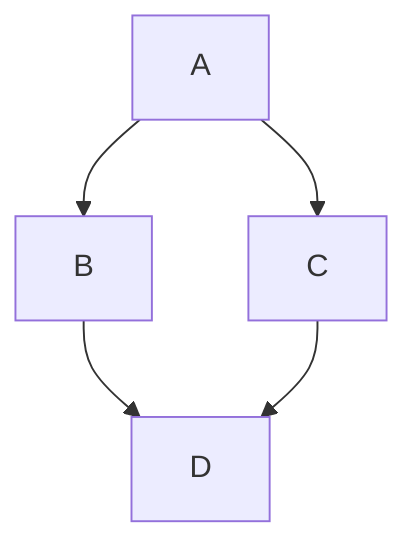

### 48.10 Iterative depth-first search

```python
def dfs(graph, start):
    stack = [start]
    seen = set()
    order = []
    while stack:
        node = stack.pop()
        if node in seen:
            continue
        seen.add(node)
        order.append(node)
        stack.extend(reversed(graph.get(node, [])))
    return order

graph = {"A": ["B", "C"], "B": ["D"], "C": ["D"], "D": []}
assert dfs(graph, "A") == ["A", "B", "D", "C"]
```

Time O(V + E). This implementation may keep duplicate pending entries, so auxiliary stack space can be O(V + E). Iterator-frame implementations can bound traversal stack space to O(V).

## 49. Practice roadmap and project assignments

### Eight-stage learning plan

| Stage | Read | Practice | Completion evidence |
|---|---|---|---|
| 1 | Chapters 1–8 | Calculator, grades, number patterns | Run scripts and explain control flow |
| 2 | Chapters 9–12 | Text cleanup, frequency counts | Choose collections correctly |
| 3 | Chapters 13–20 | Reusable utilities, CSV processing | Validate input and handle files safely |
| 4 | Chapters 21–27 | Inventory classes, streaming parser | Explain OOP and iterator protocols |
| 5 | Chapters 28–31 | Typed services, descriptors | Separate runtime behavior from static hints |
| 6 | Chapters 32–37 | Concurrent tasks and tests | Explain race conditions and cancellation |
| 7 | Chapters 38–43 | Database CLI and API | Use transactions, boundaries, and packaging |
| 8 | Chapters 44–48 | Capstone extensions and algorithms | Profile, test, document, and justify choices |

Spend roughly one study week per stage if that fits your schedule; progress by demonstrated understanding rather than a fixed deadline.

### Beginner exercises

1. Convert Celsius/Fahrenheit with validated numeric input.
2. Print a multiplication table for a supplied integer.
3. Calculate the sum of digits of a non-negative integer.
4. Count vowels, consonants, digits, and whitespace in text.
5. Find the second-largest distinct integer without sorting.
6. Implement an anagram checker and define its normalization rules.
7. Rotate a list by `k` positions, including empty input.
8. Produce a word-frequency report sorted by count, then alphabetically.
9. Merge two dictionaries by summing values for shared keys.
10. Build a menu-driven contact list using functions.

### Intermediate exercises

11. Read student marks from CSV and report invalid rows separately.
12. Implement an expense tracker using decimal amounts and JSON persistence.
13. Create a library system with books, members, and lending rules.
14. Write a generator that yields fixed-size chunks from an iterable.
15. Build a decorator that counts calls while preserving function metadata.
16. Implement a context manager that measures elapsed time on success or failure.
17. Add tests for empty input, malformed input, and boundary values.
18. Create a CLI that searches files for a literal phrase with bounded memory use.
19. Write a SQLite repository with create/read/update/delete operations.
20. Package a reusable utility with `pyproject.toml` and a command entry point.

### Advanced exercises

21. Build an async worker queue with bounded capacity and cancellation cleanup.
22. Compare sequential, threaded, and process-based execution on suitable workloads.
23. Implement a cache with maximum size and explicit invalidation.
24. Use a protocol to swap an in-memory repository for a SQLite repository.
25. Add pagination and consistent error responses to a REST API.
26. Diagnose a memory-growth problem caused by retained references.
27. Profile a slow report and optimize the measured bottleneck.
28. Add migrations and a backup/restore procedure to the task manager.
29. Implement a plugin registry with duplicate-name validation.
30. Add CI checks for tests, formatting/linting, and supported interpreter versions.

### Capstone project specifications

| Project | Required behavior | Edge cases |
|---|---|---|
| Student analytics | CSV import, summary, ranking, export | Missing marks, ties, invalid rows |
| Expense tracker | Categories, date filters, monthly totals | Decimal rounding, invalid dates |
| Library manager | Borrow/return, availability, history | Double return, unavailable book |
| API monitor | Periodic checks, latency, status history | Timeouts, retries, shutdown |
| Task API | CRUD, validation, SQLite, tests | Missing records, duplicate retries |

For each project, deliver a README, clear setup instructions, dependency metadata, tests, sample inputs, and documented limitations. Include architecture only where it explains a real design decision.

## 50. Interview questions and answers

### Fundamentals

**1. Is Python compiled or interpreted?**  
In CPython, source is compiled to bytecode and executed by the interpreter. “Interpreted” alone hides the compilation stage; other implementations may differ.

**2. What does dynamically typed mean?**  
Types belong to objects, and names can be rebound to different types. Operations are checked at runtime; optional static analysis can detect many mistakes earlier.

**3. What is the difference between `==` and `is`?**  
`==` checks equality through type behavior; `is` checks whether both references identify the same object. Use `is None` for missing-value checks.

**4. Why can a tuple contain a mutable list?**  
Tuple immutability prevents replacing its stored references. It does not freeze the referenced objects.

**5. How do list and tuple differ?**  
Lists support mutation and suit changing sequences. Tuples have fixed structure and suit records or immutable sequences. A tuple is hashable only if its elements are hashable.

**6. Do dictionaries preserve order?**  
Yes, insertion order is a language guarantee in modern Python. They are not automatically key-sorted.

**7. What is a hashable object?**  
It has a stable hash consistent with equality while used as a key. Equal objects must have equal hashes. Lists and dictionaries are unhashable.

**8. Why is `bool("False")` true?**  
Nonempty strings are truthy. To parse textual Boolean settings, explicitly recognize allowed strings.

**9. What is the difference between `append` and `extend`?**  
`append` adds one object; `extend` adds each item from an iterable. Appending a list creates a nested list element.

**10. Why does `list.sort()` return `None`?**  
It mutates the list in place. Use `sorted()` when you want a new sorted list.

### Functions and objects

**11. Explain mutable default arguments.**  
A default object is created once at function definition. Mutating it affects later calls using the same default. Use `None` and allocate inside the function.

**12. Is Python pass-by-reference?**  
The precise practical model is passing object references by assignment. Mutation can affect shared objects, but rebinding a parameter does not rebind the caller's variable.

**13. What are `*args` and `**kwargs`?**  
They collect additional positional arguments into a tuple and keyword arguments into a dictionary. At call sites, `*` and `**` unpack arguments.

**14. What is a closure?**  
A function that retains access to bindings from an enclosing function scope. Captured loop variables are normally late-bound unless deliberately captured differently.

**15. What is a decorator?**  
A callable that transforms or replaces a function/class at definition time. Common uses include caching, instrumentation, and registration.

**16. What is the difference between a generator and a list?**  
A generator computes values lazily and is normally consumed once. A list stores its elements and supports repeated iteration and indexing.

**17. What does `yield from` do?**  
It delegates generator iteration to another iterable and, for generator delegation, also supports forwarding parts of the generator protocol.

**18. What is duck typing?**  
Using an object based on supported behavior rather than requiring a specific nominal type. Protocols describe such contracts to static tools.

**19. What is `super()`?**  
A proxy for continuing lookup along the MRO. In multiple inheritance it may invoke a sibling implementation later in that order.

**20. What is the difference between `__new__` and `__init__`?**  
`__new__` creates/returns an instance; `__init__` initializes it after creation. Immutable-type customization sometimes needs `__new__`.

**21. What is a descriptor?**  
An object defining attribute access hooks while stored on a class. Functions, properties, and many declarative fields use this mechanism.

**22. What is a metaclass?**  
A class of classes that controls class creation. Prefer simpler hooks such as `__init_subclass__` when sufficient.

### Reliability and advanced topics

**23. What is the GIL?**  
In GIL-enabled CPython, it coordinates access so only one thread executes Python code in an interpreter at a time. I/O and selected native work can overlap. Optional free-threaded builds require separate consideration.

**24. When would you choose threads, processes, or asyncio?**  
Threads for blocking I/O, processes for substantial Python CPU work, and asyncio for many cooperative I/O operations. Benchmark with actual workload and library constraints.

**25. Does async mean parallel?**  
No. An event loop can interleave tasks on one thread. CPU work without yielding blocks that loop.

**26. What is a race condition?**  
Correctness depends on uncontrolled execution ordering. Protect shared invariants with synchronization or redesign around message passing.

**27. What is a context manager?**  
A protocol for scoped setup/cleanup, normally used by `with`. It keeps resource release near acquisition and handles exceptional exits.

**28. What is shallow versus deep copying?**  
Shallow copying creates a new outer container while sharing nested objects. Deep copying recursively copies supported nested objects while tracking already copied references.

**29. Do type hints validate API input?**  
Not by themselves. Runtime validation requires explicit checks or a validation framework.

**30. Why use SQL parameters?**  
They separate values from SQL syntax and let the driver bind data correctly. They do not parameterize table names or replace authorization.

**31. Why should exceptions not be silently swallowed?**  
The program can continue in an invalid state and hide the cause. Handle a known recovery path, translate the error with context, or let it propagate.

**32. What is the purpose of `if __name__ == "__main__"`?**  
It separates direct execution from import and is important for safe process-worker startup.

**33. What is the difference between a module and a package?**  
A module is an importable unit, often a file. A package can contain submodules and subpackages and has package-specific import behavior.

**34. What is memoization?**  
Caching function results by inputs. It helps repeated pure calculations but needs hashable keys and a suitable memory/invalidation policy.

**35. How would you improve slow Python code?**  
Profile, identify the bottleneck, improve algorithms and data structures, reduce I/O/allocations, then consider vectorization, caching, concurrency, or native code.

**36. Why are unit tests alone insufficient?**  
They may not reveal driver behavior, schema mismatches, configuration errors, or real integration failures. Use a balanced set of tests across boundaries.

**37. Why avoid `assert` for security checks?**  
Optimized execution can remove assertions. Security and user validation must execute unconditionally.

**38. How can a Python program leak memory without manual allocation?**  
Objects stay reachable through caches, globals, callbacks, or pending tasks. Garbage collection cannot reclaim reachable objects simply because the application no longer needs them.

**39. What is idempotency?**  
Repeating an operation has the same intended effect as doing it once. It matters for retries, such as marking an already completed task done.

**40. What makes Python code production-ready?**  
Correct behavior, validated boundaries, tests, dependency control, observability, secure configuration, resource management, and a deployment/recovery process appropriate to the application.

## 51. Cheat sheets and common mistakes

### Everyday operations

```python
numbers = [3, 1, 2]
print(len(numbers), sum(numbers), min(numbers), max(numbers))
print(sorted(numbers))
print(any(number > 2 for number in numbers))  # True
print(all(number > 0 for number in numbers))  # True
print(divmod(17, 5))  # (3, 2)

name = "  Python  "
print(name.strip().casefold())
record = {"score": 80}
print(record.get("missing", 0))
```

### Choose the right container

| Need | Starting choice |
|---|---|
| Ordered mutable sequence | `list` |
| Fixed record | `tuple` or dataclass |
| Uniqueness/membership | `set` |
| Lookup by key | `dict` |
| Counting | `Counter` |
| FIFO queue in one thread | `deque` |
| Communication between threads | `queue.Queue` |
| Priority queue | `heapq` |
| Lazy stream | Generator |

### Common mistakes and corrections

| Mistake | Correction |
|---|---|
| Comparing strings with `is` | Use `==` |
| `items = items.sort()` | Call `items.sort()` or assign `sorted(items)` |
| Shared mutable function default | Use `None` and create inside |
| Shared rows through list multiplication | Use a comprehension |
| Modifying list structure while iterating | Build a result or iterate over a deliberate copy |
| Catching every exception and ignoring it | Catch expected types and handle meaningfully |
| Assuming type hints enforce values | Add runtime validation at boundaries |
| Blocking inside `async def` | Use async I/O or an appropriate worker |
| Forgetting to await a coroutine | Await or schedule it with a managed lifetime |
| Assuming GIL means race-free | Protect multi-step invariants |
| Constructing SQL using user text | Bind query parameters |
| Relying on `__del__` for closing files | Use `with` |
| Naming a script after a needed library | Rename the local file |
| Reading huge files all at once | Iterate or stream bounded chunks |
| Logging secrets | Redact or omit them |
| Installing into system Python unnecessarily | Use a virtual environment |

### Output-prediction revision

```python
# 1. Aliasing versus copying
first = [1]
second = first
third = first[:]
second.append(2)
print(first, third)  # [1, 2] [1]

# 2. Boolean operands
print(0 or 5)        # 5
print(2 and 7)       # 7

# 3. Tuple construction
print(type((1)))     # <class 'int'>
print(type((1,)))    # <class 'tuple'>

# 4. Generator exhaustion
values = (number for number in range(3))
print(list(values))  # [0, 1, 2]
print(list(values))  # []

# 5. Loop else
for number in []:
    print(number)
else:
    print("completed")  # completed
```

### Final self-assessment

You should be able to explain object references, choose a collection, write and test functions, manage resources, design a small class, stream data, use decorators intentionally, distinguish concurrency models, parameterize SQL, package an application, and diagnose a failure from a traceback. For unfamiliar libraries, use the official reference and verify assumptions with a small example.

## 52. Official references

These links are the next references for deeper study and version-specific details. Examples in this guide are teaching examples; follow each library's compatibility requirements when installing dependencies.

| Topic | Reference |
|---|---|
| Core tutorial | [Python Tutorial](https://docs.python.org/3/tutorial/) |
| Language semantics | [Python Language Reference](https://docs.python.org/3/reference/) |
| Built-in functions | [Built-in Functions](https://docs.python.org/3/library/functions.html) |
| Standard library | [Python Standard Library](https://docs.python.org/3/library/) |
| Style conventions | [PEP 8](https://peps.python.org/pep-0008/) |
| Virtual environments | [venv](https://docs.python.org/3/library/venv.html) |
| Object protocols | [Data Model](https://docs.python.org/3/reference/datamodel.html) |
| Type annotations | [typing](https://docs.python.org/3/library/typing.html) |
| Async tasks | [asyncio Tasks](https://docs.python.org/3/library/asyncio-task.html) |
| Free threading | [Free-threading HOWTO](https://docs.python.org/3/howto/free-threading-python.html) |
| Python 3.14 changes | [What's New in Python 3.14](https://docs.python.org/3/whatsnew/3.14.html) |
| Database behavior | [sqlite3](https://docs.python.org/3/library/sqlite3.html) |
| Unit testing | [unittest](https://docs.python.org/3/library/unittest.html) |
| Packaging | [Python Packaging User Guide](https://packaging.python.org/en/latest/tutorials/packaging-projects/) |
| API framework | [FastAPI Tutorial](https://fastapi.tiangolo.com/tutorial/) |
| Validation | [Pydantic Concepts](https://docs.pydantic.dev/latest/concepts/models/) |
| Pytest | [Pytest Documentation](https://docs.pytest.org/en/stable/) |
| Numerical arrays | [NumPy User Guide](https://numpy.org/doc/stable/user/) |
| DataFrames | [pandas User Guide](https://pandas.pydata.org/docs/user_guide/) |

**Study cycle:** Read → predict → run → modify → test → explain → build.
